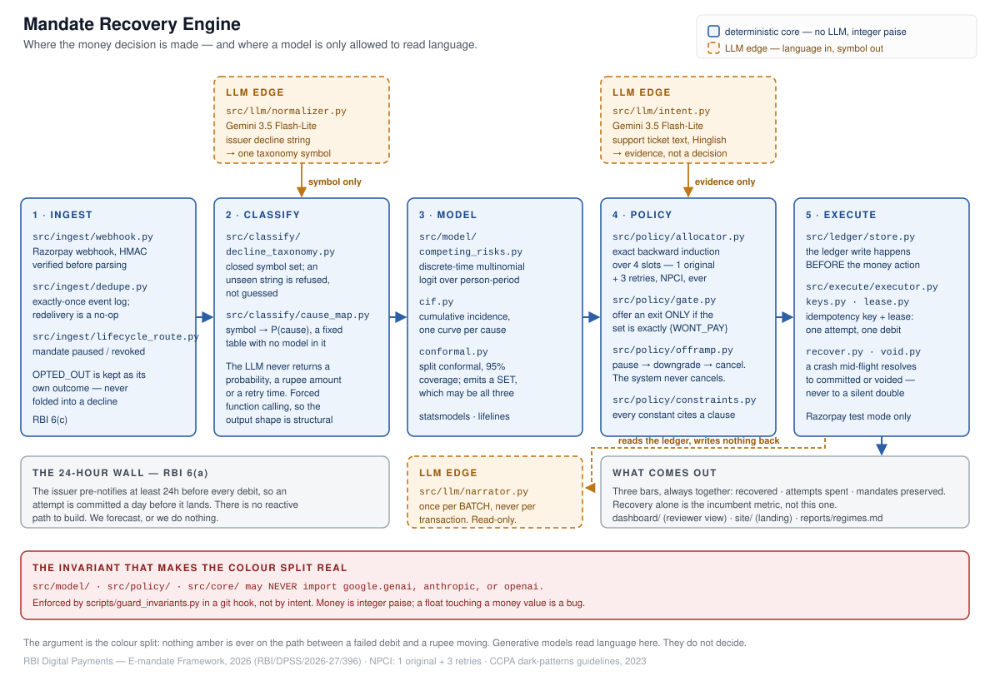

# Mandate Recovery Engine

> Every retry engine asks "will this payment succeed?"
> This one asks "which of three things went wrong?" — and sometimes
> concludes the right action is to let the customer go.

*Razorpay AI Buildathon — Track 03, AI Revenue Recovery.*

---

## What this is, in plain terms

*(Skip ahead to [The problem](#the-problem) if you already know what a UPI AutoPay mandate is. This section assumes nothing.)*

In India, when you subscribe to something — Netflix, a gym, an insurance premium, a SIP — you usually set up a **UPI AutoPay mandate**: standing permission for that company to auto-debit your bank account every billing cycle, without asking you each time. Sometimes that auto-debit fails. There are really only three reasons it ever fails:

1. **You're temporarily short on cash.** Payday just hasn't come yet.
2. **Your payment method is dead.** Card expired, account closed, mandate revoked.
3. **You want out.** You're not going to say so out loud — you're just going to let the debit fail and hope it goes away.

Every retry system on the market — including what Razorpay does today — treats all three the same way: **retry blindly on a fixed schedule** (a few days apart), and after 4 total tries (the maximum India's payments network, NPCI, allows), give up. This project calls that the **ladder**, and it's the industry standard this whole build is measured against.

**The ladder's problem isn't the schedule, it's that one response fits nobody.** A quick example — say three different customers all miss a payment on the same day:

| Customer | What's actually going on | What the ladder does | What actually helps |
|---|---|---|---|
| Priya | Payday is in 4 days | Retries randomly over the next 3 days — often *before* she's paid | Wait, then retry once she's likely to have money |
| Raj | His card expired last month | Gets retried 3 more times against a dead card | Ask him to add a new card — retrying is pointless |
| Meera | She meant to cancel weeks ago | Gets retried 3 more times and re-notified each time | Offer her an easy pause/downgrade/cancel instead of chasing her |

Retrying Raj wastes all 4 of his mandate's lifetime attempts on a card that will never work. Retrying Meera is worse than pointless — under India's rules a customer must be re-notified before every retry attempt, so grinding her with retries she's already trying to escape is the kind of "subscription trap" India's consumer-protection regulator has flagged as a banned practice.

**This project tries to tell Priya, Raj, and Meera apart — using only the kind of information a payments company already has (how the failure looked, when it happened, how large the payment is) — and then do the matching thing for each, instead of one blind retry schedule for everyone.** The three "reasons" above are what the code calls `CANT_PAY_NOW`, `CANT_PAY_EVER`, and `WONT_PAY` — see [The problem](#the-problem) below for the full table.

**The honest trade this makes:** correctly identifying Raj and Meera means *not* spending retry attempts trying to collect from them — which means this system recovers **less money in the short term** than blindly retrying everyone would. The bet is that it keeps more customers as customers in the long run (a business that can't ever be measured in this evaluation — see [What this can't do](#what-this-cant-do)), because a customer offered a pause is more likely to come back than one hounded into cancelling. The [Results](#results) section shows exactly how much money that trade costs, seed by seed, not as an average that could hide it.

**Why this can't just copy what US companies (like Stripe) do:** India's payment rules make the problem structurally different. A retry can't react to what just happened — every attempt has to be scheduled at least 24 hours in advance, by law. And there's a hard, ever cap of 4 attempts total, not "keep trying whenever." Both of those are explained fully in the next section.

*(For every domain-specific word from here on — "belief," "conformal gate," "paise," and so on — see the [Glossary](#glossary) at the very end.)*

## The problem

A recurring debit fails. Nobody chose that — not the customer, not the
merchant. The subscription just stops. This is *involuntary* churn, and it is
routinely put at 20–40% of total churn in the subscription industry; treat
that range as the reason anyone builds one of these, not as a number this
repo measured. What this repo measured is on the [Results](#results) table.

The standard response is a fixed ladder: reattempt at T+1, T+2, T+3, then
halt. That is Razorpay's documented behaviour, so it is what
[`eval/baseline_ladder.py`](eval/baseline_ladder.py) implements and what
every number here is scored against — the baseline is the incumbent, not a
strawman built to lose.

**The ladder's defect is not its schedule. It is that one rule is applied to
two customers who have nothing in common.**

- Someone short ₹300 for three days running. The ladder spends its four
  attempts inside those three days, exhausts the NPCI budget, and halts.
  A paying customer who wanted to stay is now gone.
- Someone who wants out and is passively letting the debit fail. The ladder
  spends four attempts on them, and — under the stricter reading of RBI
  clause 6(a), which is one of the two this repo ships — a pre-transaction
  notification for each. Grinding a customer who has signalled exit is what
  the CCPA's 2023 dark-patterns guidelines call a subscription trap. It is
  legal exposure, not merely unkind.

Both get the same ladder because the ladder only ever asks *will a retry
succeed?* — a question whose answer is a probability, and probabilities do
not distinguish a customer who cannot pay today from one who will never pay
again from one who does not want to.

**Three constraints make this harder in India than the equivalent problem in
the US, and they are why a Stripe-shaped solution does not transfer.**

1. **You cannot react.** RBI clause 6(a) requires the issuer's
   pre-transaction notification at least 24 hours before every debit, so an
   attempt is committed a day before it lands. Reacting to a signal in the
   last few hours is structurally impossible. You forecast, or you do
   nothing.
2. **Every attempt can lose the customer outright.** Clause 6(c) puts an
   AFA-validated opt-out in that notification — for the transaction *or the
   whole mandate*. So a notification is not free, and `OPTED_OUT` is a
   distinct outcome in this codebase, never folded into "declined".
3. **The budget is four, ever.** NPCI allows 1 original + 3 retries per
   cycle. Not four per week — four. That makes this a scarce-budget
   allocation problem, which is why the core is backward induction over four
   slots rather than a scheduler.

So the question worth asking is not *will a retry succeed* but **which of
three things went wrong** — and for one of those three answers, the correct
action is to stop retrying and offer the customer a way out.

| Latent cause | What it means | Correct action |
|---|---|---|
| `CANT_PAY_NOW` | Transient liquidity gap | Spend a slot, timed to their replenishment rhythm |
| `CANT_PAY_EVER` | Instrument dead — expired card, closed account, revoked mandate | Stop retrying. Request re-authorisation |
| `WONT_PAY` | Wants out, passively resisting | **Offer** an exit: pause, then downgrade, then cancel |

Answering that question means the system will sometimes deliberately recover
less money this cycle to protect lifetime value. That is the thesis, and the
[Results](#results) table below is what it costs.

## Results

<!-- RESULTS:BEGIN -->
*Auto-generated by `.\run.ps1 eval` (Windows) / `./run.sh eval` (Linux, macOS). Headline cell `baseline/nominal`, mean of 8 seeds. Full report: [reports/regimes.md](reports/regimes.md).*

| | recovered | attempts/recovery | **mandates preserved** |
|---|---|---|---|
| Fixed ladder (the incumbent) | ₹12,09,844.52 | 3.53 | **110/200** |
| This engine (strict) | ₹7,72,975.40 | 3.2 | **140/200** |
| This engine (permissive) | ₹7,72,975.40 | 3.2 | **140/200** |
| *Reference:* one attempt, no model | ₹7,24,405.47 | 3.45 | **149/200** |
| *Reference:* never attempt | ₹0.00 | — | **200/200** |

**Read this as a sign test, not a table.** Across 8 seeds and 256 paired comparisons, counted per seed rather than on the mean:

| comparison | preserves more | recovers more | spends FEWER attempts |
|---|---|---|---|
| engine vs **ladder** | 256 / 256 | 46 / 256 | 256 / 256 |
| engine vs **one_shot** | 26 / 256 | 154 / 256 | 20 / 256 |

**Against the incumbent, the trade holds and is stable** — more mandates preserved and fewer attempts spent in every comparison, at the cost of money. Deliberately recovering less this cycle to protect lifetime value is the thesis, not a bug.

**Against `one_shot` it does not.** One attempt on day 2 with no model, no belief and no gate preserves more mandates than the engine in 222 of 256 comparisons, and the engine spends MORE attempts in 230 of 256. The engine's only edge over it is money, and a thin one: 154 of 256. On two of the three bars, a policy with no model in it beats this one. That is in the README because it is true, and because a reader who discovers it themselves should not have to wonder what else was left out.

**The off-ramp fires, on a SYNTHETIC channel that reads privileged ground truth** (`OFFER` = 300 across every cell; 4 of 300 scored went to a mandate that would have paid — a 1.3% false-off-ramp rate (95% CI 0%–5% on the distinct sample)). The channel is configured at tpr 0.60 / fpr 0.15 and is disclosed as fabricated everywhere it appears; `reports/regimes.md` publishes its full quality curve (including a within-mandate-correlation sensitivity check the headline grid holds fixed at zero), and deliberately worthless channels at AUC 0.5, where the false rate is several times worse. This buys a tested-and-imperfect off-ramp in place of an untested-and-central one, not a good result. Separately, 8262 of 16830 REAUTHs went to mandates whose true cause is not `CANT_PAY_EVER` — but 6784 of those are the above-AFA-cliff compliance route (clause 8(a)/8(b), legally mandatory regardless of belief), so only 2452 were ever a genuine belief-inference error — see `reports/regimes.md` finding 6 for the full split (R2b).

**Where we lose:** `baseline`, `delayed_salary`, `festival_season`, `issuer_outage`, `retry_storm`, `stacking_spike` — the engine recovers less money than the ladder in these regimes. The report's "Where we lose" section gives the reason for each.
<!-- RESULTS:END -->

**Why the off-ramp numbers above moved so much.** `OFFER` was 1292 (false-off-ramp rate 15.5%) before R8 (2026-09-05); it is 300 (1.3%) now. That drop is not the channel changing — it is a CRITICAL calibration bug getting fixed. The conformal gate used to calibrate on only each mandate's slot-1 belief (200 rows, 2–3 distinct confidence values per class), then get queried against beliefs updated after 2–3 further declines that its own calibration pool had never seen anything like — a support mismatch, not a small-sample one (full derivation: `DECISIONS.md`, "R5 stats-review pass"). `fit_gate()` now grinds each calibration mandate through its own slot 2/3 trajectory too (333 rows spanning a much wider confidence range), and most of what used to register as a confident `{WONT_PAY}` singleton turns out to have been an artifact of that gap, not a real signal. Per-class coverage improved to 0.836–1.0 (marginal 0.883–0.985) — still short of the 0.95 target, `CANT_PAY_NOW` specifically — so this is a real fix, not a claim that the gate is now correct.

## Architecture



*Full size: [`docs/architecture.svg`](docs/architecture.svg).*

**The colour split is the argument.** Blue is the decision core: it is
deterministic and statistical, it moves money, and it may not import an LLM
client. Amber is the LLM edge: it reads language and hands back one symbol.

Trace any rupee from a failed debit to a retry and you never cross an amber
box. That is a property of the repo, not a promise in a diagram —
[`scripts/guard_invariants.py`](scripts/guard_invariants.py) exits non-zero
if `src/model/`, `src/policy/` or `src/core/` imports `google.genai`,
`anthropic` or `openai`. It runs two ways: as `./run.sh lint` /
`.
un.ps1 lint`, and in CI on every push. It is *not* a git hook -- this
sentence claimed one until R7, and `.git/hooks/` holds only the stock
samples, so a commit made locally was never blocked. CI is what actually
gates a push.

Three LLM calls exist, and each one is deliberately shaped so it *cannot*
become a decision:

| Module | Reads | Returns | Why it is safe |
|---|---|---|---|
| [`src/llm/normalizer.py`](src/llm/normalizer.py) | An issuer's decline string, which differs across banks | One symbol from a closed taxonomy | The symbol → cause probability table is a fixed constant in `src/classify/cause_map.py`. The model picks a label; it never picks a number |
| [`src/llm/intent.py`](src/llm/intent.py) | Support-ticket text, including Hinglish | Exit-intent evidence | Enters the belief as evidence, then still has to pass the conformal gate before it can change an action |
| [`src/llm/narrator.py`](src/llm/narrator.py) | The ledger, once per batch | Merchant-facing prose | One-way. Runs after every decision is made, never per transaction, and writes nothing back |

All three go through forced function calling
(`tool_config.function_calling_config.mode = "ANY"`, declared in
[`src/llm/tools.py`](src/llm/tools.py)), so malformed JSON is structurally
impossible rather than caught downstream.

The reason for the split is measured, not asserted:
[`bench/llm_vs_stats.py`](bench/llm_vs_stats.py) runs an LLM-as-classifier
baseline against the statistical model on the same held-out split and
reports AUC, p95 latency, cost per 1k decisions, and run-to-run variance on
identical input. The variance column is the argument — same input, different
retry time, is disqualifying in a payments path whatever the accuracy.

## Reproducing every number

### Prerequisites

| | | |
|---|---|---|
| **Python 3.13** | required | 3.12 works; set `PY_TARGET=python3.12` (POSIX) or edit `$PyTarget` in `setup.ps1` |
| **Docker** | required for the test suite | one `postgres:16` container. Without it the suite **fails**, deliberately — see below |
| **Node 20+** | optional | only the reviewer dashboard and the landing page need it |
| **A Gemini API key** | optional | only `bench` and `golden` call a model. Everything else — the whole decision core, the eval, the report — runs without one |

### Install, then run

Both entry points do the same things and take the same arguments. Pick the
row for your platform; nothing below needs translating.

**Linux / macOS**

```sh
./setup.sh                   # venv, pip install -r requirements.txt, postgres, .env
./run.sh eval                # all regimes, both compliance profiles (~15 min)
./run.sh bench               # LLM vs statistical core (needs an API key)
./run.sh chaos 50
./run.sh report
./run.sh help                # everything else
```

**Windows**

```powershell
.\setup.ps1
.\run.ps1 eval               # all regimes, both compliance profiles (~15 min)
.\run.ps1 bench              # LLM vs statistical core (needs an API key)
.\run.ps1 chaos -Kills 50
.\run.ps1 report
.\run.ps1 help               # everything else
```

`./run.sh` mirrors `.\run.ps1` except for four actions it declines rather
than approximating: `up`/`down` (per-server console windows and
`Win32_Process` teardown have no honest POSIX equivalent — use `db-up` plus
`serve`, `dashboard` and `site` in separate terminals), `verify` (a
Windows-desktop pre-flight with a live Razorpay probe), and `freeze` (block
B2 only, already executed). `run.sh help` says so in the same breath as the
task list, and a test fails if either runner grows an action the other
neither implements nor declines.

**A fresh clone has no `reports/*.json`.** `.gitignore` excludes them, so the
tracked `reports/*.md` are present and readable immediately, but `report`,
`dashboard` and `site` have nothing to read until `eval` has run. That is
documented rather than worked around: the artifacts are outputs, and
committing them would make "reproducible by one command" unfalsifiable.

Evaluation protocol was frozen before any policy code was written:
`reports/FREEZE_HASH`.

`reports/regimes.json` is the single machine-readable artifact; every table
and figure in `reports/regimes.md` is read out of it and nothing is computed
at report time, so the report cannot drift from the run. Two runs of the
same seeds produce **byte-identical** output — the artifact carries no
wall-clock timing, precisely so that the claim can be checked by hashing and
not only by reading numbers. That claim used to hold on one machine and fail
across two: every artifact writer used Python's default newline translation,
so the same run emitted CRLF on Windows and LF on Linux. Fixed at R7 —
`newline="\n"` in every writer, plus a `.gitattributes` — so the hash now
survives a cross-platform check, which is the only check that was ever worth
making.

### The test suite needs Postgres, and says so

```sh
./run.sh db-up               # Linux / macOS -- starts the mrdb container
./run.sh test
```

```powershell
.\run.ps1 up                 # Windows -- starts the container, among other things
.\run.ps1 test
```

Either way, `docker start mrdb` does the same thing directly.

Without a database the suite **fails**. It does not skip. Around 150 tests —
the whole ledger, executor, lease, void, recover, commit, webhook, dedupe,
read-API and chaos surface — depend on Postgres, and while they used to skip
quietly, a green suite meant nothing about the money path. Set
`MANDATEIQ_ALLOW_PG_SKIP=1` (POSIX: `export …`, Windows: `set …`) to restore
the old skipping behaviour if you genuinely want it; the skip reason then
names the variable, so it is visible in the log as a decision rather than an
accident.

### Continuous integration

[`.github/workflows/ci.yml`](.github/workflows/ci.yml) runs install, lint,
the full suite against a `postgres:16` service, `eval-quick` and `report` on
`ubuntu-latest`, on every push. That workflow is the evidence for the claim
this section makes: before R7 nothing in this repo had ever run on Linux,
and "a reviewer on another platform can follow these commands" was an
assertion. Now it is a measurement that re-proves itself on every push.

### The HTTP API

```sh
./run.sh serve               # or:  .\run.ps1 serve
```

`uvicorn` on port 8000, mounting two routers: the Razorpay webhook
(`POST /webhook/razorpay`) and three read endpoints added at R6 —
`GET /ledger/{mandate_id}`, `GET /plan/{mandate_id}` and
`GET /decision/{decision_sha256}`. The reads serve real rows from a live
schema: the append-only ledger trail, every plan the allocator wrote with
its belief and conformal set, and any decision looked up by its hash. Money
comes back as both integer paise and a formatted string, and beliefs carry
their verbatim provenance, because the parsed form drops it.

**The three read routes have no authentication and no tenant scoping.**
Anyone who can reach the port and knows a `mandate_id` reads that mandate's
amounts, decision rationale, outcome and decline reasons. The webhook next
door verifies an HMAC signature; these verify nothing. That is a stated
non-decision rather than an oversight — R6's gate was "return real rows from
a live schema", and inventing an auth scheme nobody specified would be a
worse answer than naming the gap. It costs nothing here (test mode only, no
deployment) and would block day one of anything real. It also bounds the
acquirer-dashboard story: these serve the audit *content* and none of the
audit *controls*.

## What this can't do

The landing page sells the idea. This section is where the build is honest
about what it does not have. Every claim below is reproducible from
`reports/`.

1. **The off-ramp fires only because a SYNTHETIC channel makes it fire, and
   that channel reads privileged ground truth.** Until R5 this item read
   "the off-ramp never fires": `OFFER` was chosen **0 times** in every
   published run, because `cause_map` pinned P(WONT_PAY) at 0.10 under both
   symbols the proxy alphabet could emit, so the `{WONT_PAY}` singleton the
   conformal gate requires was unreachable for any alpha, seed or regime.
   R5 added a `CUSTOMER_DECLINED` class (0.70 toward `WONT_PAY`) and an
   evaluation channel that emits it — and that channel **reads each
   mandate's true latent cause**, which the policy itself must never see,
   and feeds a fabricated observation into the decision path. It is a
   materially stronger privileged read than the score-only one
   `false_reauth_count` already makes. `OFFER` = **300** and the
   false-off-ramp rate is **1.3%** (4 of 300) — down from 1292/15.5% until
   R8 (2026-09-05) fixed a CRITICAL calibration bug in the conformal gate
   itself (the gate used to be calibrated on only 200 slot-1 beliefs, never
   seeing anything resembling the confidence a real multi-decline
   trajectory reaches — see "Why the off-ramp numbers above moved so much"
   under Results). Neither number is evidence that a real `payment_cancelled`
   feed carries this much signal — that claim is unchanged by the fix.
   What changed is that the lane is now **tested-and-imperfect** instead of
   **untested-and-central**; `reports/regimes.md` publishes the whole
   quality curve, including deliberately worthless channels at AUC 0.5
   where the false rate is 20-25%. It is still the most important line in
   this file.
2. **The evaluation is synthetic.** It measures whether encoding real
   constraints beats ignoring them. It is not a lift number that transfers
   to production traffic.
3. **A model-free policy beats the engine on two of three bars.** Against
   `one attempt, no model`, the engine preserves fewer mandates in 222 of
   256 paired comparisons and spends more attempts in 230 of 256. Its only
   edge is money, 154 of 256. More seeds made this finding stronger, not
   weaker. (These moved at R5, when the off-ramp became reachable and
   started spending decisions that were previously attempts, and again at
   R8 when fixing the gate's calibration made the off-ramp fire far less
   often; the finding itself did not change direction either time.)
4. **8,262 of 16,830 re-auth requests went to a mandate whose true cause is
   not CANT_PAY_EVER** - the issuer_outage regime's own pre-registered
   falsification criterion, unchanged in meaning since Day 1. But 6,784 of
   those are the above-AFA-cliff compliance route (clause 8(a)/8(b)): legally
   mandatory regardless of what the model believes, not a model failure. Only
   **2,452** were ever a genuine belief-inference error - well under a third
   of the headline number, and the split (R2b) exists because the two were
   never separated before that session. Investigated at R8 for whether
   either half is a fixable model bug (the user asked directly): it is not.
   Most of this is either the AFA-cliff route above, or Bayesian updating
   behaving correctly under evidence the `issuer_outage` regime was
   pre-registered specifically to make ambiguous — reducing it further would
   mean either inventing an unmeasured cost constant (rejected; this project
   has declined hand-picked constants three times before, see
   `src/policy/allocator.py`) or reopening the frozen simulator. Same
   session, same conclusion for "no timing discrimination" below (item 8):
   traced to `eval/allocator_sweep.py`'s `hazard_from_fit`, which already
   collapses every day outside the salary window to one bucket, and to a
   design-matrix choice (excluding `days_since_last_attempt`/
   `committed_day_of_month`) that an earlier session already measured as
   genuinely uninformative in this design, not overlooked.
5. **The off-ramp is reachable in evaluation and NOT wired into the live
   decision path.** `src/policy/offramp.py::construct_offer()` now has a
   real caller (R5: an `OFFER` plan carries the actual pause/downgrade/cancel
   menu in its audit trail), and `src/execute/intent_channel.py` gives
   `src/llm/intent.py` its first path into belief. But R4's
   `src/execute/cycle.py` is not driven by either channel: R5's gate asks
   for the off-ramp to be reachable and measured, not deployed, and a
   production intent channel needs a support-ticket ingestion path that
   does not exist here.
6. **`belief.observe_terminal()` and `AllocationContext.with_terminal()` now
   have a production caller (R4's `src/execute/cycle.py`), but it is not
   driven by any live traffic.** The published
   `n_attempt_after_terminal == 0` claim (fixed, R2 - a dead instrument no
   longer gets re-attempted, and every re-solve after an observed terminal
   outcome now updates belief and context correctly) is proven true of the
   evaluation harness. R4 built the cycle orchestrator that drives the same
   sequence against Postgres, so the fix now reaches the money path in
   code - but nothing calls `plan_cycle()` / `run_due()` on a schedule
   here, and no real Razorpay traffic has ever gone through it. Proven by
   test, not by traffic.
7. **The read API has no authentication and no tenant scoping.** R6's three
   endpoints serve real money amounts, decision rationale and customer
   outcomes to anyone who can reach the port and knows a `mandate_id`. The
   webhook beside them verifies an HMAC signature; these verify nothing.
   Named rather than fixed: R6's gate was about returning real rows, and an
   invented auth scheme would be a worse answer than a stated gap. It also
   caps what the acquirer-dashboard framing can claim — audit content,
   without audit controls.
8. **There is no timing discrimination.** Every attempt lands on day 2, so
   the `strict` and `permissive` compliance profiles are provably the same
   function on this evaluation.
9. **Exit intent is weakly identified from payment data alone.** Without
   merchant product-usage signals, intent AUC is modest - which is exactly
   why the system offers rather than acts.
10. **Whether a retry requires its own 24h pre-notification is unresolved**
   in the RBI circular. Both interpretations ship; neither is assumed.
11. **The LLM benchmark is quota-bound, and its accuracy numbers would
   improve with a larger one.** Both arms run on Google free-tier keys.
   `gemini-3.5-flash-lite` gets 500 calls/day, which funds the full arm: 140
   accuracy rows plus 5 repeats over a 30-row subsample at two temperatures.
   `gemini-3.5-flash` gets **20 calls/day**. The same plan would need 22 days
   there, so its plan is fitted to the cap instead
   ([`fit_plan_to_quota`](bench/llm_vs_stats.py)) and it runs as a
   **variance-only probe**: no accuracy pass at all, 10 repeats of one
   byte-identical row at each temperature. It reports whether identical input
   produced identical answers and how far the probabilities moved. It reports
   **no AUC, no log loss and no Brier**, and its numbers are not comparable
   with the full arm.
   With a paid-tier quota the fit would not trigger: the flash arm would run
   the same 440-call plan as flash-lite, and both arms' accuracy estimates
   would tighten with more rows — the accuracy comparison here is limited by
   call budget, not by anything the models did. The variance finding is the
   one that does not need more quota: it is an existence claim, and one
   disagreement between identical calls settles it.

### Reading the numbers correctly

`reports/results.json` publishes **means over 8 seeds** (mandates preserved
140/200 is 140.125 rounded). `reports/mandates.json` is the **seed-0 batch
only**, which preserves 139. Both are correct and they are not the same
number. The landing page renders the means; the reviewer dashboard renders
seed 0. Do not compare a figure from one against a figure from the other.

## Regulatory basis

RBI *Digital Payments – E-mandate Framework, 2026* (RBI/DPSS/2026-27/396,
21 April 2026), clauses 4(c), 6(a), 6(c), 8(a), 8(b), 10(c). NPCI attempt
limit: 1 original + 3 retries. CCPA *Guidelines for Prevention and
Regulation of Dark Patterns, 2023* — "subscription trap".

Every constant is cited at its definition in `src/policy/constraints.py`.

## Glossary

Plain-language definitions for every term used above, in the order a
first-time reader is likely to meet them. Skip this if you already know
Indian payments or the statistics.

**Payments / regulatory terms**

| Term | Meaning |
|---|---|
| **Mandate** (UPI AutoPay mandate) | A standing customer permission letting a merchant auto-debit their bank account every billing cycle, without asking each time — like a US "recurring card on file," but bank-account-level and government-regulated. |
| **NPCI** | National Payments Corporation of India — runs the UPI network and sets the hard rule this project builds around: **4 attempts total** per failed payment (1 original + 3 retries), ever. |
| **RBI** | Reserve Bank of India — India's central bank. The source of the e-mandate rules (clauses 6(a), 6(c), 8(a), 8(b), etc.) this project cites at every constant. |
| **AFA** (Additional Factor Authentication) | The extra verification step (like an OTP) Indian rules require above a certain payment amount — ₹15,000 for most subscriptions, ₹1,00,000 for insurance/mutual funds/credit cards. Above that line, the rules require asking the customer to re-authorise rather than silently retrying. |
| **The ladder** | This project's name for the industry-standard incumbent: retry on a fixed schedule (T+1, T+2, T+3), then stop. What every number in this repo is measured against. |
| **Dark pattern** | A UI/process design that manipulates or exhausts a user into an outcome they wouldn't choose freely — here, retrying and re-notifying a customer who already wants to leave until they're forced into an awkward manual cancellation. Explicitly against India's 2023 consumer-protection guidelines. |
| **Off-ramp** | This project's name for offering an exit — pause, then downgrade, then cancel — instead of retrying someone who wants out. The system only ever *offers* this; it never cancels a mandate on its own. |
| **Paise** | 1/100th of a rupee — India's equivalent of a cent. Every money value in this codebase is stored as a whole-number count of paise, never a rupee float, so rounding errors can't quietly appear in a real charge. |

**The three "reasons a payment fails" and how the system acts**

| Term | Meaning |
|---|---|
| **Latent cause** | The *real*, never-directly-observable reason a payment failed. The system never gets to see this — it can only guess from indirect evidence (the decline reason, timing, amount). |
| `CANT_PAY_NOW` | Latent cause: temporary cash shortfall. Action: retry, timed to when the customer likely gets paid. |
| `CANT_PAY_EVER` | Latent cause: the payment method itself is dead (expired card, closed account, revoked mandate). Action: stop retrying, ask the customer to re-authorise with a new method. |
| `WONT_PAY` | Latent cause: the customer wants out and is passively letting payments fail rather than actively cancelling. Action: offer the off-ramp. |
| **Belief** | The system's current best guess at the latent cause, expressed as three probabilities (e.g. "70% cash shortfall, 20% dead card, 10% wants out") that update every time a new payment failure comes in. |
| **Decline class** | The specific reason a bank gave for the failure (e.g. "insufficient funds," "card expired") — the raw evidence a belief update is based on. |
| **Slot** | One of the (at most 4) attempt opportunities in a billing cycle. Slot 1 is the original attempt; slots 2-4 are the three retries NPCI allows. |

**The statistics**

| Term | Meaning |
|---|---|
| **Hazard model / competing-risks model** | The statistical model predicting, for a given attempt, the probability of each possible outcome (still pending, recovered, dead, opted out) — "competing risks" because several different bad outcomes are competing to happen first, not just one. |
| **Backward induction** | The decision-making method: work backwards from the last possible attempt, figuring out the best choice at each point given what the best choice would be at every point after it. This is what lets the system pick, exactly, whether to retry now, wait, or stop — no guessing, no shortcuts. |
| **Conformal gate / conformal prediction** | The safety check gating the off-ramp. Instead of asking the model for one guess, it asks for the full *set* of plausible causes, and only offers an exit when that set has narrowed to exactly `{WONT_PAY}` and nothing else — a built-in defense against confidently cancelling a customer who was actually just short on cash. |
| **Coverage** | How often the conformal gate's answer set actually contains the true cause, measured against a target (95% here). If coverage is below target, the gate is more confident than its evidence actually supports. |
| **LTV** (lifetime value) | The estimated total future value of keeping a customer, used to weigh "recover this payment now" against "risk losing this customer forever" in the same units (rupees), so the system can make that trade-off honestly instead of by gut feel. |
| **Sign test** | A statistics method that counts, across many repeated simulation runs ("seeds"), how many times one approach beats another — used here instead of a single average, because an average can hide the fact that a result flips between runs. |
| **AUC, log loss, Brier score** | Standard ways of scoring how good a prediction is. Lower log loss/Brier and higher AUC (up to a max of 1.0) mean a better-calibrated model; all three are reported so a reader can check the model's quality rather than take "it works" on faith. |
| **CI** (confidence interval) | A range meant to contain the true value most of the time — reported alongside a measured rate (like the false-off-ramp rate) so a reader can tell a solid result from a shaky one based on a handful of cases. |

**The evaluation setup**

| Term | Meaning |
|---|---|
| **Regime** | One simulated "what if" scenario stress-testing the system (e.g. `festival_season`, `issuer_outage`, `delayed_salary`) — used to check the system under conditions that aren't the easy average case. |
| **Arm** | One variant of the underlying simulation math (`nominal`, `misspecified`, `coupled`) — used to check the model isn't just curve-fitted to its own assumptions. |
| **Profile** (`strict` / `permissive`) | Two different, both-plausible readings of an ambiguous point in the RBI rules about whether a retry needs its own fresh customer notification. The system supports both rather than guessing which is legally correct. |
| **Seed** | One full run of the simulation with one specific random-number starting point. Results are reported across 8 seeds, not just one, so a lucky or unlucky single run can't be mistaken for a real finding. |
| **Frozen (`eval/frozen/`)** | The evaluation setup and simulated customer population, locked before any decision-making code was written, so the system couldn't be tuned to flatter its own test. |
| **Idempotency key / ledger** | Engineering safeguards ensuring a payment is never accidentally charged twice, even if the system crashes and restarts mid-attempt — the ledger is a permanent, append-only record of every money-related action taken. |

## Repo map

| Path | What |
|---|---|
| `PROJECT_EXPLAINED.txt` | Plain-text explanation of the whole project |
| `run.ps1` | Task runner (replaces make) |
| **`WHAT_BROKE.md`** | **Start here for the failures.** The readable digest of the two files below — the bugs that taught something and the review findings that changed a published number, in ~180 lines |
| `DECISIONS.md` | Where a model was used, where one deliberately wasn't (~6,300 lines, the full record) |
| `POSTMORTEM.md` | What broke during the build — all 12 incidents, in full |
| `scripts/guard_*.py` | Invariants enforced mechanically, not by prose |
| `docs/new-failure-class.md` | Checklist for adding a decline class to the taxonomy |
| `eval/frozen/` | Pre-registered, immutable |
| `docs/architecture.svg` | The diagram above — core in blue, LLM edge in amber |
