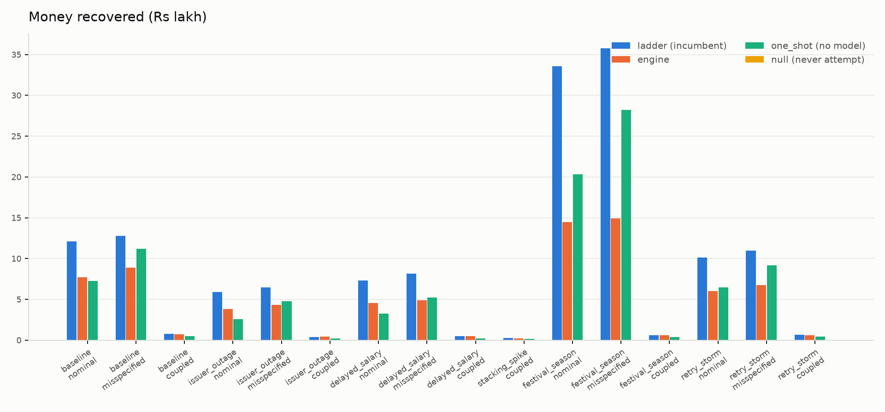
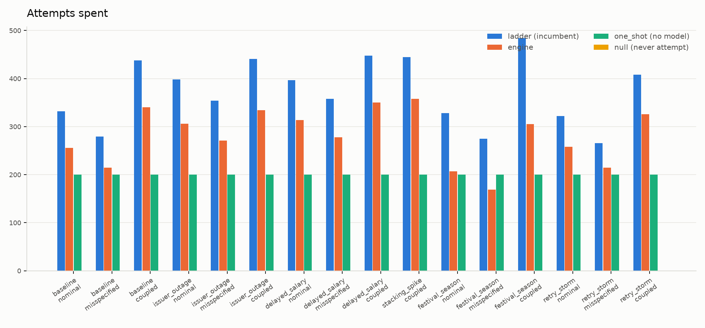
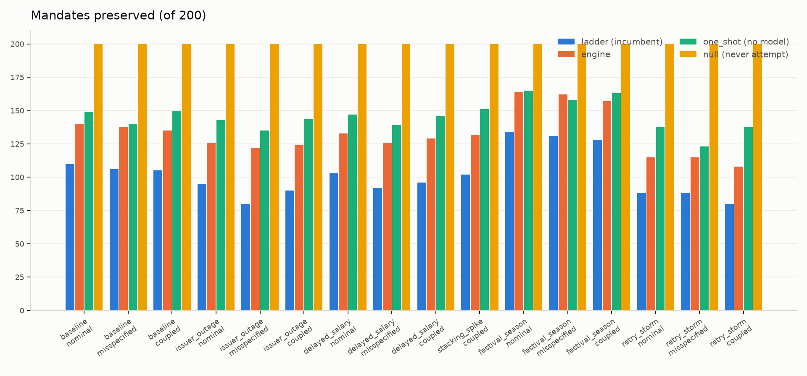

# Stress regimes -- B13

Generated by `python -m eval.report`. Every number below is read out of `reports/regimes.json`; nothing is computed in this file. To reproduce every number in this report from a clean tree -- the sweep and the rendering -- one command:

```powershell
.\run.ps1 eval          # Windows
```

```sh
./run.sh eval           # Linux / macOS
```

(`.\run.ps1 report` / `./run.sh report` re-renders the tables and figures from the existing artifact without re-running the sweep. It cannot change a number; only `eval` can.)

Seed `0` · arms ['nominal', 'misspecified', 'coupled'] · profiles ['strict', 'permissive'] · off-ramp gate: **conformal** {'alpha': 0.05, 'n_calib': 333, 'calib_seed': 424242, 'channel': {'kind': 'decline', 'tpr': 0.6, 'fpr': 0.15}, 'channel_realised': {'n_wont_pay': 95, 'n_other': 278, 'positive_on_wont_pay': 64, 'positive_on_other': 47, 'tpr_realised': 0.6736842105263158, 'fpr_realised': 0.16906474820143885}, 'calib_per_class': {'CANT_PAY_NOW': 167, 'CANT_PAY_EVER': 72, 'WONT_PAY': 94}, 'mondrian_floor': 19.0}

The three bars are always reported together. Recovery rate alone is the incumbent's scorecard, and a policy tuned to it would be a different product.

## Headline findings

0. **Across 8 seeds, 256 paired comparisons, counted per seed rather than on the mean.** A gap of a few mandates on one seed is not a result, so this sign test -- not the averaged table below -- is what every claim here rests on.

| comparison | preserves more | recovers more | spends FEWER attempts |
|---|---|---|---|
| engine vs **ladder** | 256 / 256 | 46 / 256 | 256 / 256 |
| engine vs **one_shot** | 26 / 256 | 154 / 256 | 20 / 256 |

Fewer attempts is better, so the third column is the favourable count, not a win count.

**Against the incumbent the trade is real and stable.** The engine preserves more in 256 of 256 and spends fewer attempts in 256 of 256, while recovering less money in 210. That is the thesis, and it survives 8 seeds.

**Against `one_shot` it does not hold.** A policy that makes one attempt on day 2 with no model, no belief and no gate preserves MORE mandates than the engine in 222 of 256 comparisons, and the engine spends MORE attempts in 230 of 256. The engine's only edge is money, and a thin one: it recovers more in 154 of 256 (60%). **On two of the three headline bars the engine is beaten by a policy with no model in it.** The seed-0 draft reported this as 14 of 16 cells on the preserved bar; 8 seeds make the finding stronger, not weaker.

1. **The headline three-bar comparison does not identify anything, and the reference policies are in the table to prove it.** The engine preserves more mandates than the ladder in 16 of 16 cells and recovers more money in 1. But `null` -- never attempt, no model -- preserves **every** mandate in all 16 cells, and `one_shot` -- one attempt on day 2, no model, no belief, no gate -- preserves more than the engine in 15 of 16 while spending fewer attempts. Every metric here is monotonically decreasing in attempt count by construction, so "preserves more" follows from "attempts less" and is not evidence of knowing WHY a payment failed. B5 recorded this exact confound; B13's first draft reproduced it by omitting the column.

2. **The off-ramp now fires, and both of its error costs are real numbers instead of one number and a structural zero. `OFFER` = 300 across 256 engine cells; of the 300 scored against the exact counterfactual, 4 went to a mandate that WOULD have paid and 296 to one that would not -- a false-off-ramp rate of 1.3%.** Before R5 this finding read "the off-ramp cannot fire in this harness", and it was correct: the proxy decline alphabet had two symbols and `cause_map` gave `WONT_PAY` a prior of 0.10 under both, so the singleton `{WONT_PAY}` the gate fires on was unreachable for any alpha, seed or regime. R5 added `CUSTOMER_DECLINED` (prior 0.70 toward `WONT_PAY`) and a **synthetic, quality-parameterised** channel that emits it. Live singleton-`{WONT_PAY}` rate on this run: 0.0012 mean across cells, against exactly 0 before.

    **This channel is SYNTHETIC and it reads privileged ground truth.** It is configured at tpr 0.60 / fpr 0.15 and REALISED tpr 0.599 / fpr 0.143 on this grid (28,856 WONT_PAY draws, 70,700 others). It reads each mandate's true latent cause -- which the policy itself must never see -- and feeds a fabricated observation into the DECISION path. That is a materially stronger claim than the score-only privileged read `false_reauth_count` already makes. It is not evidence that a real `payment_cancelled` feed carries this much information; the full quality curve, including deliberately worthless channels at AUC 0.5, is in "Off-ramp reachability, and what it costs" below. 22,004 RETROSPECTIVE post-terminal gate queries remain EXCLUDED from every coverage/singleton statistic here (see finding 3). What R5 bought is a tested-and-imperfect off-ramp in place of an untested-and-central one -- not a good result, a checkable one.

3. **The off-ramp gate under-covers.** Over the 1,145,048 LIVE decision points the gate was actually queried at (excluding 22,004 retrospective post-terminal queries -- see finding 2), marginal coverage is 0.883-0.985 against a 0.95 target, with per-class coverage as low as 0.836 (`CANT_PAY_NOW`) -- a Mondrian violation on a class that drives REAUTH. Mean set size is 2.56-2.81 of 3. Two earlier defects inflated this: the smoothing key was derived from the belief itself (making the WONT_PAY p-value a hash of a constant rather than a rank), and coverage was scored only over the 200 slot-1 beliefs rather than every query, which also made six numbers print as thirty-two. Both are fixed; the reported figure moved from an apparent 0.980 to a real under-coverage.

4. **No timing discrimination.** Every attempt the engine commits lands on day 2, the earliest legal day, in every regime and under both compliance profiles. The hazard model's only temporal feature is `in_salary_window` (days 1-5) plus the slot index, so backward induction has nothing with which to prefer day 4 to day 2. The 'timed to their replenishment rhythm' claim in the project's own framing is **not supported by this evidence**; the engine's advantage comes from *whether* and *how often* it attempts, not *when*. This confirms B12's shadow-mode finding (`SAME_ACTION_DIFFERENT_DAY = 0`) across all five regimes.

5. **FIXED, R2 (2026-09-04): the allocator used to want to retry instruments the issuer had just confirmed dead.** Re-solving after a terminal outcome returned `ATTEMPT` 0 times across all engine cells on this run -- structurally zero, not merely measured low: a hard `permitted()` rule (`instrument_dead`) denies `ATTEMPT` outright once the instrument is known dead, regardless of belief. `belief.observe_terminal()` also replaces belief with a MEASURED posterior on the observed outcome -- P(CANT_PAY_EVER | DEAD) = 0.8991, P(WONT_PAY | OPTED_OUT) = 0.9040, both measured directly against `eval/frozen/sim_config.yaml`'s own generative process, NOT the degenerate 100%-certain collapse an earlier same-day version of this fix assumed and stats-reviewer then proved false and irreversible (`cause_map`'s priors contain no zeros, so a belief collapsed to exactly 1.0 can never be moved by any later evidence). The corrected, measured version changes no action anywhere in this sweep -- REAUTH's economics dominate STOP at 90% confidence exactly as they did at 100% for every realistic amount in this corpus -- but is no longer an overconfident, irreversible claim about a fact the frozen simulator's own numbers say is only ~90% certain. Before this fix existed at all: `belief.update()`'s ordinary naive-Bayes compounding, with no floor, meant a single `CARD_EXPIRED` observation often could not overtake a slot-1 `INSUFFICIENT_FUNDS` prior, so `CANT_PAY_NOW` kept dominating and the CANT_PAY_EVER -> REAUTH row of the project's own cause/action table never fired on observed evidence -- measured at 4,032 such events on the pre-fix artifact. The `OPTED_OUT` case was worse: the proxy decline-class function returns `None` for it, so the OLD code's re-solve was skipped ENTIRELY and no decision was ever recorded for what happens after a customer opts out. A related audit-trail bug found in the same review -- `_binding_constraint()` did not know about `instrument_dead`, so a REAUTH forced by this rule alone recorded `binding_constraint = None`, misrepresenting a hard-forced decision as a free economic choice -- is also fixed. See DECISIONS.md and POSTMORTEM Incidents 11-12 for the full account, including a conformal-measurement contamination the fix briefly introduced and then closed (finding 2 above).

6. Actions across all engine cells: 16830 REAUTH (**6784** issued via the above-AFA-cliff compliance route -- clause 8(a)/8(b), legally mandatory regardless of belief -- and **2452** that are genuine belief-inference errors against a mandate whose true cause is not `CANT_PAY_EVER`), 13504 STOP, 300 OFFER. The pre-registered `issuer_outage` falsification criterion, `8262` REAUTHs on a mandate whose true cause is not `CANT_PAY_EVER`, keeps its Day-1 meaning unchanged (DECISIONS.md, R0) -- the split above is ADDED alongside it, R2b, because that one number conflates a legal requirement with a belief error: only `2452` of the `8262` were ever a real inference mistake. Constraint violations: **0**.

## Where we lose

A policy that wins every regime is evidence the regimes were tuned, not that the policy is good. These are the losses.

### Money left on the table, against the ladder

"Stopped-on" counts every mandate the engine did not carry to a terminal outcome -- whether it never attempted, or attempted and then stopped. The counterfactual grinds on consecutive days from where we stopped, which always lands inside the days-1-5 salary window, so this is an **upper bound** on what was given up, not a point estimate.

| regime | arm | profile | money delta | stopped-on that would have paid | value |
|---|---|---|---:|---:|---:|
| festival_season | misspecified | strict | -58.4% | 45 | ₹22,12,849.97 |
| festival_season | misspecified | permissive | -58.4% | 45 | ₹22,12,849.97 |
| festival_season | nominal | strict | -57.0% | 40 | ₹19,33,151.39 |
| festival_season | nominal | permissive | -57.0% | 40 | ₹19,33,151.39 |
| baseline | nominal | strict | -36.1% | 16 | ₹5,16,734.28 |
| baseline | nominal | permissive | -36.1% | 16 | ₹5,16,734.28 |
| retry_storm | misspecified | strict | -38.6% | 15 | ₹5,32,771.37 |
| retry_storm | misspecified | permissive | -38.6% | 15 | ₹5,32,771.37 |
| retry_storm | nominal | strict | -40.8% | 13 | ₹4,40,823.88 |
| retry_storm | nominal | permissive | -40.8% | 13 | ₹4,40,823.88 |
| baseline | misspecified | strict | -30.2% | 18 | ₹6,00,058.88 |
| baseline | misspecified | permissive | -30.2% | 18 | ₹6,00,058.88 |
| delayed_salary | misspecified | strict | -40.2% | 12 | ₹3,50,984.66 |
| delayed_salary | misspecified | permissive | -40.2% | 12 | ₹3,50,984.66 |
| delayed_salary | nominal | strict | -37.7% | 8 | ₹2,19,604.63 |
| delayed_salary | nominal | permissive | -37.7% | 8 | ₹2,19,604.63 |
| issuer_outage | misspecified | strict | -33.3% | 12 | ₹3,23,513.48 |
| issuer_outage | misspecified | permissive | -33.3% | 12 | ₹3,23,513.48 |
| issuer_outage | nominal | strict | -35.7% | 8 | ₹2,48,187.31 |
| issuer_outage | nominal | permissive | -35.7% | 8 | ₹2,48,187.31 |
| stacking_spike | coupled | strict | -15.0% | 3 | ₹2,880.22 |
| stacking_spike | coupled | permissive | -15.0% | 3 | ₹2,880.22 |
| baseline | coupled | strict | -4.8% | 4 | ₹5,927.08 |
| baseline | coupled | permissive | -4.8% | 4 | ₹5,927.08 |
| retry_storm | coupled | strict | -3.9% | 4 | ₹6,049.50 |
| retry_storm | coupled | permissive | -3.9% | 4 | ₹6,049.50 |
| festival_season | coupled | strict | -3.1% | 1 | ₹2,727.77 |
| festival_season | coupled | permissive | -3.1% | 1 | ₹2,727.77 |
| delayed_salary | coupled | strict | -1.8% | 2 | ₹3,402.92 |
| delayed_salary | coupled | permissive | -1.8% | 2 | ₹3,402.92 |

### Cells where a model-free one-attempt policy preserves more than the engine

`one_shot` spends one attempt per mandate on day 2 and consults no model, no belief and no gate. Where it preserves more while spending fewer attempts, the engine's preserved-mandate bar is not evidence of cause inference.

| regime | arm | profile | engine preserved / attempts | one_shot preserved / attempts |
|---|---|---|---:|---:|
| baseline | nominal | strict | 140 / 256 | 149 / 200 |
| baseline | misspecified | strict | 138 / 215 | 140 / 200 |
| baseline | coupled | strict | 135 / 340 | 150 / 200 |
| issuer_outage | nominal | strict | 126 / 306 | 143 / 200 |
| issuer_outage | misspecified | strict | 122 / 271 | 135 / 200 |
| issuer_outage | coupled | strict | 124 / 334 | 144 / 200 |
| delayed_salary | nominal | strict | 133 / 314 | 147 / 200 |
| delayed_salary | misspecified | strict | 126 / 278 | 139 / 200 |
| delayed_salary | coupled | strict | 129 / 350 | 146 / 200 |
| stacking_spike | coupled | strict | 132 / 358 | 151 / 200 |
| festival_season | nominal | strict | 164 / 207 | 165 / 200 |
| festival_season | coupled | strict | 157 / 305 | 163 / 200 |
| retry_storm | nominal | strict | 115 / 258 | 138 / 200 |
| retry_storm | misspecified | strict | 115 / 215 | 123 / 200 |
| retry_storm | coupled | strict | 108 / 326 | 138 / 200 |
| baseline | nominal | permissive | 140 / 256 | 149 / 200 |
| baseline | misspecified | permissive | 138 / 215 | 140 / 200 |
| baseline | coupled | permissive | 135 / 340 | 150 / 200 |
| issuer_outage | nominal | permissive | 126 / 306 | 143 / 200 |
| issuer_outage | misspecified | permissive | 122 / 271 | 135 / 200 |
| issuer_outage | coupled | permissive | 124 / 334 | 144 / 200 |
| delayed_salary | nominal | permissive | 133 / 314 | 147 / 200 |
| delayed_salary | misspecified | permissive | 126 / 278 | 139 / 200 |
| delayed_salary | coupled | permissive | 129 / 350 | 146 / 200 |
| stacking_spike | coupled | permissive | 132 / 358 | 151 / 200 |
| festival_season | nominal | permissive | 164 / 207 | 165 / 200 |
| festival_season | coupled | permissive | 157 / 305 | 163 / 200 |
| retry_storm | nominal | permissive | 115 / 258 | 138 / 200 |
| retry_storm | misspecified | permissive | 115 / 215 | 123 / 200 |
| retry_storm | coupled | permissive | 108 / 326 | 138 / 200 |

## The three bars -- profile `strict`

| regime | arm | policy | recovered | attempts | preserved | stopped-on that would have paid (n / value) | false off-ramp | false REAUTH |
|---|---|---|---:|---:|---:|---:|---:|---:|
| baseline | nominal | ladder | ₹12,09,844.52 | 332 | 110/200 | -- | -- | -- |
| baseline | nominal | engine | ₹7,72,975.40 | 256 | 140/200 | 16 / ₹5,16,734.28 | 0 / ₹0.00 | 21 / ₹8,27,402.96 |
| baseline | nominal | one_shot | ₹7,24,405.47 | 200 | 149/200 | -- | -- | -- |
| baseline | nominal | null | ₹0.00 | 0 | 200/200 | -- | -- | -- |
| baseline | misspecified | ladder | ₹12,76,298.86 | 279 | 106/200 | -- | -- | -- |
| baseline | misspecified | engine | ₹8,90,368.15 | 215 | 138/200 | 18 / ₹6,00,058.88 | 0 / ₹0.00 | 26 / ₹8,68,980.94 |
| baseline | misspecified | one_shot | ₹11,19,393.76 | 200 | 140/200 | -- | -- | -- |
| baseline | misspecified | null | ₹0.00 | 0 | 200/200 | -- | -- | -- |
| baseline | coupled | ladder | ₹76,415.20 | 438 | 105/200 | -- | -- | -- |
| baseline | coupled | engine | ₹72,744.91 | 340 | 135/200 | 4 / ₹5,927.08 | 0 / ₹0.00 | 22 / ₹8,37,815.78 |
| baseline | coupled | one_shot | ₹51,638.78 | 200 | 150/200 | -- | -- | -- |
| baseline | coupled | null | ₹0.00 | 0 | 200/200 | -- | -- | -- |
| issuer_outage | nominal | ladder | ₹5,89,856.35 | 398 | 95/200 | -- | -- | -- |
| issuer_outage | nominal | engine | ₹3,79,368.06 | 306 | 126/200 | 8 / ₹2,48,187.31 | 0 / ₹0.00 | 32 / ₹9,28,732.03 |
| issuer_outage | nominal | one_shot | ₹2,55,757.88 | 200 | 143/200 | -- | -- | -- |
| issuer_outage | nominal | null | ₹0.00 | 0 | 200/200 | -- | -- | -- |
| issuer_outage | misspecified | ladder | ₹6,47,592.60 | 354 | 80/200 | -- | -- | -- |
| issuer_outage | misspecified | engine | ₹4,31,814.07 | 271 | 122/200 | 12 / ₹3,23,513.48 | 0 / ₹187.04 | 37 / ₹10,04,596.94 |
| issuer_outage | misspecified | one_shot | ₹4,75,650.64 | 200 | 135/200 | -- | -- | -- |
| issuer_outage | misspecified | null | ₹0.00 | 0 | 200/200 | -- | -- | -- |
| issuer_outage | coupled | ladder | ₹40,820.43 | 441 | 90/200 | -- | -- | -- |
| issuer_outage | coupled | engine | ₹44,068.79 | 334 | 124/200 | 2 / ₹3,873.25 | 0 / ₹0.00 | 33 / ₹9,67,803.98 |
| issuer_outage | coupled | one_shot | ₹20,116.17 | 200 | 144/200 | -- | -- | -- |
| issuer_outage | coupled | null | ₹0.00 | 0 | 200/200 | -- | -- | -- |
| delayed_salary | nominal | ladder | ₹7,29,597.78 | 397 | 103/200 | -- | -- | -- |
| delayed_salary | nominal | engine | ₹4,54,492.27 | 314 | 133/200 | 8 / ₹2,19,604.63 | 0 / ₹0.00 | 23 / ₹8,50,908.11 |
| delayed_salary | nominal | one_shot | ₹3,27,324.98 | 200 | 147/200 | -- | -- | -- |
| delayed_salary | nominal | null | ₹0.00 | 0 | 200/200 | -- | -- | -- |
| delayed_salary | misspecified | ladder | ₹8,18,171.38 | 358 | 92/200 | -- | -- | -- |
| delayed_salary | misspecified | engine | ₹4,89,251.86 | 278 | 126/200 | 12 / ₹3,50,984.66 | 0 / ₹0.00 | 27 / ₹8,87,821.07 |
| delayed_salary | misspecified | one_shot | ₹5,20,966.06 | 200 | 139/200 | -- | -- | -- |
| delayed_salary | misspecified | null | ₹0.00 | 0 | 200/200 | -- | -- | -- |
| delayed_salary | coupled | ladder | ₹49,546.58 | 448 | 96/200 | -- | -- | -- |
| delayed_salary | coupled | engine | ₹48,671.52 | 350 | 129/200 | 2 / ₹3,402.92 | 0 / ₹372.70 | 24 / ₹8,55,680.22 |
| delayed_salary | coupled | one_shot | ₹22,444.05 | 200 | 146/200 | -- | -- | -- |
| delayed_salary | coupled | null | ₹0.00 | 0 | 200/200 | -- | -- | -- |
| stacking_spike | coupled | ladder | ₹25,023.10 | 445 | 102/200 | -- | -- | -- |
| stacking_spike | coupled | engine | ₹21,257.52 | 358 | 132/200 | 3 / ₹2,880.22 | 0 / ₹0.00 | 22 / ₹8,31,895.85 |
| stacking_spike | coupled | one_shot | ₹15,578.24 | 200 | 151/200 | -- | -- | -- |
| stacking_spike | coupled | null | ₹0.00 | 0 | 200/200 | -- | -- | -- |
| festival_season | nominal | ladder | ₹33,57,617.77 | 328 | 134/200 | -- | -- | -- |
| festival_season | nominal | engine | ₹14,45,018.17 | 207 | 164/200 | 40 / ₹19,33,151.39 | 0 / ₹0.00 | 58 / ₹28,08,179.14 |
| festival_season | nominal | one_shot | ₹20,34,280.07 | 200 | 165/200 | -- | -- | -- |
| festival_season | nominal | null | ₹0.00 | 0 | 200/200 | -- | -- | -- |
| festival_season | misspecified | ladder | ₹35,77,772.71 | 275 | 131/200 | -- | -- | -- |
| festival_season | misspecified | engine | ₹14,89,557.85 | 169 | 162/200 | 45 / ₹22,12,849.97 | 0 / ₹0.00 | 59 / ₹28,74,208.12 |
| festival_season | misspecified | one_shot | ₹28,20,632.67 | 200 | 158/200 | -- | -- | -- |
| festival_season | misspecified | null | ₹0.00 | 0 | 200/200 | -- | -- | -- |
| festival_season | coupled | ladder | ₹59,762.55 | 484 | 128/200 | -- | -- | -- |
| festival_season | coupled | engine | ₹57,924.65 | 305 | 157/200 | 1 / ₹2,727.77 | 0 / ₹0.00 | 58 / ₹28,45,068.66 |
| festival_season | coupled | one_shot | ₹39,709.16 | 200 | 163/200 | -- | -- | -- |
| festival_season | coupled | null | ₹0.00 | 0 | 200/200 | -- | -- | -- |
| retry_storm | nominal | ladder | ₹10,13,111.07 | 322 | 88/200 | -- | -- | -- |
| retry_storm | nominal | engine | ₹6,00,073.71 | 258 | 115/200 | 13 / ₹4,40,823.88 | 0 / ₹0.00 | 23 / ₹9,12,123.22 |
| retry_storm | nominal | one_shot | ₹6,47,403.00 | 200 | 138/200 | -- | -- | -- |
| retry_storm | nominal | null | ₹0.00 | 0 | 200/200 | -- | -- | -- |
| retry_storm | misspecified | ladder | ₹10,98,555.81 | 266 | 88/200 | -- | -- | -- |
| retry_storm | misspecified | engine | ₹6,74,884.38 | 215 | 115/200 | 15 / ₹5,32,771.37 | 0 / ₹0.00 | 28 / ₹9,79,182.12 |
| retry_storm | misspecified | one_shot | ₹9,14,490.44 | 200 | 123/200 | -- | -- | -- |
| retry_storm | misspecified | null | ₹0.00 | 0 | 200/200 | -- | -- | -- |
| retry_storm | coupled | ladder | ₹65,436.98 | 408 | 80/200 | -- | -- | -- |
| retry_storm | coupled | engine | ₹62,910.98 | 326 | 108/200 | 4 / ₹6,049.50 | 0 / ₹0.00 | 24 / ₹9,32,507.52 |
| retry_storm | coupled | one_shot | ₹45,767.51 | 200 | 138/200 | -- | -- | -- |
| retry_storm | coupled | null | ₹0.00 | 0 | 200/200 | -- | -- | -- |

## Engine vs ladder, deltas -- profile `strict`

| regime | arm | money | attempts | preserved | iatrogenic (ladder->engine) |
|---|---|---:|---:|---:|---:|
| baseline | nominal | -36.1% | -22.9% | +30 | 0 -> 0 |
| baseline | misspecified | -30.2% | -22.9% | +32 | 0 -> 0 |
| baseline | coupled | -4.8% | -22.4% | +30 | 124 -> 103 |
| issuer_outage | nominal | -35.7% | -23.1% | +31 | 0 -> 0 |
| issuer_outage | misspecified | -33.3% | -23.4% | +42 | 0 -> 0 |
| issuer_outage | coupled | +8.0% | -24.3% | +34 | 42 -> 32 |
| delayed_salary | nominal | -37.7% | -20.9% | +30 | 0 -> 0 |
| delayed_salary | misspecified | -40.2% | -22.3% | +34 | 0 -> 0 |
| delayed_salary | coupled | -1.8% | -21.9% | +33 | 51 -> 40 |
| stacking_spike | coupled | -15.0% | -19.6% | +30 | 139 -> 121 |
| festival_season | nominal | -57.0% | -36.9% | +30 | 0 -> 0 |
| festival_season | misspecified | -58.4% | -38.5% | +31 | 0 -> 0 |
| festival_season | coupled | -3.1% | -37.0% | +29 | 189 -> 116 |
| retry_storm | nominal | -40.8% | -19.9% | +27 | 0 -> 0 |
| retry_storm | misspecified | -38.6% | -19.2% | +27 | 0 -> 0 |
| retry_storm | coupled | -3.9% | -20.1% | +28 | 101 -> 84 |

## Compliance profiles

**All 64 cells are byte-identical between `strict` and `permissive`, and this is a defect in the compliance model, not a finding about the policy.**

An earlier version of this report explained it as "the constraint never binds at the optimum, because the policy always picks the earliest legal day anyway". That explanation is wrong, and it understated the problem. The two profiles are provably the same function. In `allocator.solve()`:

```python
lead = 1 if profile.requires_fresh_notification(next_slot) else 0
earliest = ctx.plan_day + lead
if ctx.committed_days:
    earliest = max(earliest, ctx.committed_days[-1] + 1)
```

`with_attempt()` sets `plan_day = on_day` *and* appends `on_day` to `committed_days`, and the initial context starts at `plan_day=1, committed_days=(1,)`. So `committed_days[-1] == plan_day` always, and `max(plan_day + 0, plan_day + 1)` equals `max(plan_day + 1, plan_day + 1)`. The `lead` term is absorbed by the monotonicity clamp at every reachable context: the candidate day *sets* are identical, not merely the chosen optimum. A policy with perfect timing discrimination would still produce byte-identical results under the two profiles.

CLAUDE.md requires that the strict/permissive ambiguity never be hard-coded to one interpretation and that both be evaluated. That requirement is currently satisfied in form and empty in substance: the code branches on the profile and the branch cannot change any output. Modelling the 24h pre-notification lead as a real lead -- rather than as a one-day offset that the clamp swallows -- is the fix, and it is not done. (payments-domain, 2026-08-31.)

## LTV sensitivity

_Generated 2026-09-04T11:23:17.879348+00:00 by `python -m eval.ltv_sensitivity`. Default `mandate_ltv_paise` (`config/policy_costs.yaml`): ₹1,800.00. LTV grid: 66 points, 0 to 100,000,000 paise._

**Does raising the assumed mandate LTV ever make the engine recover as much raw money as the incumbent ladder?** Two slices, both fixed before this sweep's first run (see `eval/ltv_sensitivity.py`'s module docstring for the exact, non-cherry-picked selection rule):

### Headline -- the project's own canonical comparison slice

**baseline/nominal/strict/seed=0** -- mean mandate amount ₹13,292.41 (200 mandates).

**No crossing anywhere in the swept LTV range** (0 to 100,000,000 paise) -- engine.recovered_paise stays below ladder.recovered_paise at every point, from -₹1,50,470.99 at LTV=0 to -₹10,20,387.83 at the ceiling. `interpolate_crossing()` correctly refuses to compute a break-even here (no sign change exists to interpolate) rather than extrapolate one.

### Worked example -- the first pre-existing engine-wins-on-money cell

Not the headline claim: this cell is one of the 36/256 cells `reports/gates.md`'s B13 entry already measured where the engine beats the ladder on raw recovered money AT THE DEFAULT LTV. It exists here to show `interpolate_crossing()` computing a real break-even against genuine swept data, since the headline slice has none to compute.

**issuer_outage/nominal/strict/seed=0** -- mean mandate amount ₹13,292.41 (200 mandates).

| Bracket (LTV, paise) | Crossing LTV | As a ratio to mean amount |
|---|---|---|
| [100,000, 150,000] | ₹1,192.69 | **0.090** |
| [450,000, 500,000] | ₹4,557.40 | **0.343** |

Each crossing is a linear interpolation between two SWEPT-AND-MEASURED grid points (`src.core.money.interpolate_crossing()`), not a third measurement -- the allocator's decisions are discrete, so the true curve is a step function and the crossing is only as precise as the grid's own resolution in that bracket.

## Off-ramp reachability, and what it costs (R5)

_Generated 2026-09-05T12:43:12.776869+00:00 by `python -m eval.offramp_channel`. Slice: `baseline/nominal/strict`, 8 seeds. Operating point (PRE-REGISTERED in that module's docstring before its first run): tpr 0.60 / fpr 0.15._

> **Every channel below is SYNTHETIC.** `eval/frozen/simulator.py` emits no decline strings and no support tickets, so this channel fabricates them -- and it does so by reading the simulator's **privileged true cause** and feeding the result into the DECISION path. That is a stronger claim than the score-only privileged read `false_reauth_count` already makes, which is why the channel's own ROC is published in the same table as every number it produced. Nothing here is evidence that a real `payment_cancelled` feed or a real support-ticket feed carries this much information.

R5's gate does not promise the off-ramp is *correct*, only that it is **reachable and measured**. Untested-and-central is a weaker position than tested-and-imperfect; this table buys the second one.

### Channel `decline`

A fabricated `DeclineClass.CUSTOMER_DECLINED` observation, inverted through `src/classify/cause_map.py`'s independent hand-authored table -- so the allocator's belief is realistically MISCALIBRATED, never oracular.

| tpr | fpr | realised AUC (95% CI) | n_offer | false off-ramp | true off-ramp | **false rate** (95% CI) | recovered | vs ladder | preserved | coverage |
|---|---|---|---|---|---|---|---|---|---|---|
| 0.30 | 0.30 | 0.494 [0.476, 0.514] | 4 | 1 | 3 | **25.0%**<br>[5%, 70%] | ₹61,67,997.16 | -₹35,10,759.02 | 1087 | 0.981 |
| 0.50 | 0.50 | 0.503 [0.482, 0.523] | 16 | 4 | 12 | **25.0%**<br>[10%, 49%] | ₹62,08,260.37 | -₹34,70,495.81 | 1075 | 0.984 |
| 0.40 | 0.30 | 0.545 [0.526, 0.565] | 5 | 1 | 4 | **20.0%**<br>[4%, 62%] | ₹62,34,660.39 | -₹34,44,095.79 | 1091 | 0.978 |
| 0.50 | 0.25 | 0.627 [0.608, 0.647] | 8 | 1 | 7 | **12.5%**<br>[2%, 47%] | ₹60,46,928.86 | -₹36,31,827.32 | 1097 | 0.965 |
| 0.60 **<-** | 0.15 | 0.726 [0.710, 0.743] | 10 | 0 | 10 | **0.0%**<br>[0%, 28%] | ₹61,83,803.19 | -₹34,94,952.99 | 1121 | 0.958 |
| 0.75 | 0.10 | 0.825 [0.810, 0.841] | 23 | 1 | 22 | **4.3%**<br>[1%, 21%] | ₹62,19,143.23 | -₹34,59,612.95 | 1115 | 0.927 |
| 0.90 | 0.05 | 0.918 [0.906, 0.930] | 52 | 4 | 48 | **7.7%**<br>[3%, 18%] | ₹62,25,395.42 | -₹34,53,360.76 | 1143 | 0.915 |
| 1.00 | 0.00 | 1.000 [1.000, 1.000] | 97 | 8 | 89 | **8.2%**<br>[4%, 15%] | ₹62,28,609.08 | -₹34,50,147.10 | 1191 | 0.943 |

The ladder recovers ₹96,78,756.18 on this slice and preserves 884 mandates, at every row -- it is channel-blind by construction (no belief, no gate), so it is run once per seed and reused rather than re-measured 8 times to produce the same number.

**Reading it.** The off-ramp fires 97 times at the point where it fires most and as few as 4 where it fires least -- but the COUNT is not the finding, because a channel that rarely fires and a channel that fires accurately look the same in it. The false-off-ramp RATE is what moves with channel quality, and it is 25.0% at the least informative channel measured (realised AUC 0.494). That degradation is the point of sweeping quality: a table showing only good channels would prove nothing.

**The intervals are wide, and that is the honest reading.** `n_offer` on this slice runs from single digits to about a hundred, so a false-off-ramp rate printed alone would be a number plus or minus tens of points presented as a result. Wilson intervals (`bench/llm_vs_stats.py`'s own implementation, imported rather than rewritten) are shown beside every rate; they ignore the pooling of eight seeds, so read each width as a FLOOR on the true uncertainty. What survives that is the SHAPE of the curve, not any single cell.

Marginal conformal coverage is re-measured after re-calibrating the gate at each point -- the channel changes the belief distribution, so it changes the calibration pool, and reusing a pool drawn under a different channel would break exactly the exchangeability split conformal's guarantee rests on.

### Channel `intent`

A fabricated exit-intent score, mapped through `src/execute/intent_channel.py`'s **declared** operating point, which is independent of the sweep's own (tpr, fpr) and therefore misspecified at every row but one. `src/policy/` never imports `src.llm`; the score crosses the boundary as a plain float. **This channel is measured here and NOT folded into the published grid** -- a fabricated support-ticket feed is a bigger fabrication than a fabricated decline string.

| tpr | fpr | realised AUC (95% CI) | n_offer | false off-ramp | true off-ramp | **false rate** (95% CI) | recovered | vs ladder | preserved | coverage |
|---|---|---|---|---|---|---|---|---|---|---|
| 0.30 | 0.30 | 0.492 [0.474, 0.511] | 0 | 0 | 0 | - | ₹62,00,204.21 | -₹34,78,551.97 | 1135 | 0.958 |
| 0.50 | 0.50 | 0.497 [0.477, 0.518] | 0 | 0 | 0 | - | ₹62,00,204.21 | -₹34,78,551.97 | 1135 | 0.955 |
| 0.40 | 0.30 | 0.544 [0.524, 0.565] | 0 | 0 | 0 | - | ₹62,00,204.21 | -₹34,78,551.97 | 1135 | 0.958 |
| 0.50 | 0.25 | 0.621 [0.602, 0.641] | 0 | 0 | 0 | - | ₹62,00,204.21 | -₹34,78,551.97 | 1135 | 0.955 |
| 0.60 **<-** | 0.15 | 0.734 [0.716, 0.752] | 0 | 0 | 0 | - | ₹62,00,204.21 | -₹34,78,551.97 | 1135 | 0.952 |
| 0.75 | 0.10 | 0.824 [0.808, 0.840] | 0 | 0 | 0 | - | ₹62,00,204.21 | -₹34,78,551.97 | 1135 | 0.949 |
| 0.90 | 0.05 | 0.923 [0.911, 0.934] | 20 | 4 | 16 | **20.0%**<br>[8%, 42%] | ₹60,56,956.40 | -₹36,21,799.78 | 1145 | 0.957 |
| 1.00 | 0.00 | 1.000 [1.000, 1.000] | 71 | 5 | 66 | **7.0%**<br>[3%, 15%] | ₹62,64,876.82 | -₹34,13,879.36 | 1195 | 0.965 |

The ladder recovers ₹96,78,756.18 on this slice and preserves 884 mandates, at every row -- it is channel-blind by construction (no belief, no gate), so it is run once per seed and reused rather than re-measured 8 times to produce the same number.

**Reading it.** The off-ramp fires 71 times at the point where it fires most and as few as 0 where it fires least -- but the COUNT is not the finding, because a channel that rarely fires and a channel that fires accurately look the same in it. The false-off-ramp RATE is what moves with channel quality, and it is undefined at the least informative channel measured, because no off-ramp fired there at all. That degradation is the point of sweeping quality: a table showing only good channels would prove nothing.

**The intervals are wide, and that is the honest reading.** `n_offer` on this slice runs from single digits to about a hundred, so a false-off-ramp rate printed alone would be a number plus or minus tens of points presented as a result. Wilson intervals (`bench/llm_vs_stats.py`'s own implementation, imported rather than rewritten) are shown beside every rate; they ignore the pooling of eight seeds, so read each width as a FLOOR on the true uncertainty. What survives that is the SHAPE of the curve, not any single cell.

Marginal conformal coverage is re-measured after re-calibrating the gate at each point -- the channel changes the belief distribution, so it changes the calibration pool, and reusing a pool drawn under a different channel would break exactly the exchangeability split conformal's guarantee rests on.

### Within-mandate correlation, held fixed at zero above (R5 review pass)

A 2026-09-05 review found the grid above sweeps channel **discrimination** while holding the one dimension the firing rule is actually sensitive to fixed at exactly zero: `WontPayChannel.fires()` draws an independent coin flip every call. `should_act()` needs roughly TWO coincident false firings on the SAME mandate to open the off-ramp (one `CUSTOMER_DECLINED` moves belief to ~0.62 WONT_PAY; the fitted gate's own singleton boundary sits at 0.80-0.90), and two independent draws from one customer's decline history is not a safe assumption -- a customer who dismisses one collect request is plausibly more likely to dismiss the next, for reasons that have nothing to do with wanting to leave.

This table holds the marginal `(tpr, fpr)` FIXED at the pre-registered operating point and varies only `habitual_fraction` -- the fraction of non-WONT_PAY mandates that are "habitual dismissers" firing at an elevated rate, vs. never. `1.00` (top row) is EXACTLY the operating-point row of the main grid above, repeated so the two read as one continuous measurement rather than an unexplained fourth number.

| habitual_fraction | n_offer | false off-ramp | rate (95% CI) | fpr realised | repeat false-fire rate |
|---:|---:|---:|---|---:|---:|
| 1.00 (= main grid) | 10 | 0 | 0.0% [0%, 28%] | 0.141 | 0.024 (n=1103) |
| 0.50 | 25 | 6 | 24.0% [11%, 43%] | 0.163 | 0.035 (n=1103) |
| 0.30 | 33 | 11 | 33.3% [20%, 50%] | 0.164 | 0.067 (n=1103) |
| 0.15 | 22 | 7 | 31.8% [16%, 53%] | 0.168 | 0.074 (n=1103) |

The realised fpr stays within 0.141-0.168 across every row -- the marginal genuinely holds fixed -- while the false-off-ramp rate moves from 0.0% to 31.8% and the repeat-false-fire rate from 0.024 to 0.074. Same discrimination, same published ROC point, more than double the false-off-ramp rate: the main grid's operating-point row is not robust to an assumption it holds fixed at zero.

**Second-order synthetic, disclosed as such**: there is no real decline-string corpus this project has access to that could calibrate `habitual_fraction` itself. This table establishes SENSITIVITY -- the rate is not robust to a fixed-at-zero assumption -- not a corrected point estimate.

## Off-ramp gate: coverage per (regime, arm, seed)

Coverage is *measured*, not assumed. The gate is calibrated once on `baseline` and reused unchanged under every regime. **Read seed-to-seed spread before regime-to-regime spread**: a 2026-09-05 review measured the two as comparable in magnitude on this table's own data (e.g. baseline/nominal swings 0.873-0.917 across seeds alone), so a single row's coverage moving is not, by itself, evidence that regime is the cause. This corrects an earlier version of this sentence ("any degradation here is a real result"), which the same review found the table's own contents falsify. What the gate's own R5 entry establishes independently -- that coverage is measurably below the nominal target -- still stands; only the attribution to REGIME specifically was unsupported.

| regime | arm | seed | gate live | marginal coverage | per-class coverage (NOW / EVER / WONT) | mean set size | singleton rate | singleton {WONT_PAY} | OFFERs |
|---|---|---:|---|---:|---:|---:|---:|---:|---:|
| baseline | nominal | 0 | conformal | 0.956 (n=4612) | 0.936 / 0.953 / 0.982 | 2.69 / 3 | 0.023 | 0.001 | 0 |
| baseline | misspecified | 0 | conformal | 0.972 (n=4422) | 0.955 / 0.992 / 0.983 | 2.72 / 3 | 0.012 | 0.000 | 0 |
| baseline | coupled | 0 | conformal | 0.931 (n=4968) | 0.898 / 0.985 / 0.951 | 2.59 / 3 | 0.048 | 0.001 | 1 |
| issuer_outage | nominal | 0 | conformal | 0.950 (n=4808) | 0.923 / 0.980 / 0.974 | 2.63 / 3 | 0.035 | 0.001 | 1 |
| issuer_outage | misspecified | 0 | conformal | 0.958 (n=4674) | 0.920 / 0.997 / 0.991 | 2.64 / 3 | 0.027 | 0.001 | 2 |
| issuer_outage | coupled | 0 | conformal | 0.914 (n=4920) | 0.856 / 0.992 / 0.957 | 2.59 / 3 | 0.043 | 0.001 | 2 |
| delayed_salary | nominal | 0 | conformal | 0.960 (n=4828) | 0.940 / 0.978 / 0.979 | 2.65 / 3 | 0.039 | 0.003 | 5 |
| delayed_salary | misspecified | 0 | conformal | 0.966 (n=4682) | 0.941 / 1.000 / 0.985 | 2.66 / 3 | 0.032 | 0.001 | 0 |
| delayed_salary | coupled | 0 | conformal | 0.961 (n=4978) | 0.940 / 0.993 / 0.977 | 2.62 / 3 | 0.046 | 0.002 | 3 |
| stacking_spike | coupled | 0 | conformal | 0.959 (n=5004) | 0.928 / 0.995 / 0.987 | 2.61 / 3 | 0.051 | 0.002 | 2 |
| festival_season | nominal | 0 | conformal | 0.931 (n=3486) | 0.892 / 0.983 / 0.989 | 2.69 / 3 | 0.023 | 0.001 | 0 |
| festival_season | misspecified | 0 | conformal | 0.933 (n=3274) | 0.895 / 0.994 / 0.988 | 2.73 / 3 | 0.010 | 0.001 | 1 |
| festival_season | coupled | 0 | conformal | 0.923 (n=3830) | 0.894 / 1.000 / 0.963 | 2.63 / 3 | 0.050 | 0.001 | 0 |
| retry_storm | nominal | 0 | conformal | 0.968 (n=4630) | 0.960 / 0.957 / 0.976 | 2.72 / 3 | 0.017 | 0.000 | 0 |
| retry_storm | misspecified | 0 | conformal | 0.961 (n=4430) | 0.917 / 1.000 / 0.983 | 2.72 / 3 | 0.010 | 0.000 | 0 |
| retry_storm | coupled | 0 | conformal | 0.965 (n=4838) | 0.939 / 0.974 / 0.984 | 2.65 / 3 | 0.043 | 0.000 | 1 |
| baseline | nominal | 1 | conformal | 0.959 (n=4390) | 0.936 / 0.986 / 0.981 | 2.70 / 3 | 0.025 | 0.002 | 1 |
| baseline | misspecified | 1 | conformal | 0.948 (n=4142) | 0.908 / 0.998 / 0.979 | 2.76 / 3 | 0.011 | 0.001 | 1 |
| baseline | coupled | 1 | conformal | 0.951 (n=4712) | 0.922 / 0.993 / 0.978 | 2.62 / 3 | 0.055 | 0.001 | 1 |
| issuer_outage | nominal | 1 | conformal | 0.969 (n=4610) | 0.953 / 0.988 / 0.985 | 2.66 / 3 | 0.047 | 0.000 | 0 |
| issuer_outage | misspecified | 1 | conformal | 0.959 (n=4422) | 0.937 / 0.986 / 0.981 | 2.68 / 3 | 0.033 | 0.000 | 0 |
| issuer_outage | coupled | 1 | conformal | 0.956 (n=4650) | 0.947 / 0.961 / 0.969 | 2.65 / 3 | 0.056 | 0.001 | 1 |
| delayed_salary | nominal | 1 | conformal | 0.966 (n=4614) | 0.954 / 0.986 / 0.974 | 2.68 / 3 | 0.042 | 0.001 | 1 |
| delayed_salary | misspecified | 1 | conformal | 0.960 (n=4454) | 0.931 / 0.990 / 0.995 | 2.67 / 3 | 0.028 | 0.000 | 0 |
| delayed_salary | coupled | 1 | conformal | 0.959 (n=4690) | 0.942 / 0.979 / 0.977 | 2.65 / 3 | 0.061 | 0.001 | 1 |
| stacking_spike | coupled | 1 | conformal | 0.961 (n=4770) | 0.951 / 0.991 / 0.962 | 2.62 / 3 | 0.063 | 0.003 | 3 |
| festival_season | nominal | 1 | conformal | 0.928 (n=3464) | 0.902 / 0.984 / 0.978 | 2.70 / 3 | 0.032 | 0.001 | 0 |
| festival_season | misspecified | 1 | conformal | 0.963 (n=3288) | 0.946 / 1.000 / 0.997 | 2.81 / 3 | 0.008 | 0.001 | 1 |
| festival_season | coupled | 1 | conformal | 0.912 (n=3820) | 0.887 / 0.996 / 0.953 | 2.63 / 3 | 0.069 | 0.001 | 0 |
| retry_storm | nominal | 1 | conformal | 0.968 (n=4358) | 0.944 / 0.992 / 0.981 | 2.69 / 3 | 0.019 | 0.001 | 2 |
| retry_storm | misspecified | 1 | conformal | 0.967 (n=4112) | 0.926 / 0.989 / 0.995 | 2.73 / 3 | 0.006 | 0.000 | 0 |
| retry_storm | coupled | 1 | conformal | 0.958 (n=4614) | 0.922 / 0.995 / 0.980 | 2.66 / 3 | 0.042 | 0.002 | 3 |
| baseline | nominal | 2 | conformal | 0.966 (n=4504) | 0.944 / 0.990 / 0.981 | 2.70 / 3 | 0.024 | 0.001 | 0 |
| baseline | misspecified | 2 | conformal | 0.958 (n=4354) | 0.923 / 0.994 / 0.984 | 2.67 / 3 | 0.012 | 0.001 | 0 |
| baseline | coupled | 2 | conformal | 0.941 (n=4832) | 0.909 / 0.988 / 0.962 | 2.60 / 3 | 0.053 | 0.002 | 0 |
| issuer_outage | nominal | 2 | conformal | 0.935 (n=4640) | 0.890 / 0.986 / 0.974 | 2.60 / 3 | 0.041 | 0.002 | 1 |
| issuer_outage | misspecified | 2 | conformal | 0.951 (n=4548) | 0.914 / 0.998 / 0.976 | 2.65 / 3 | 0.032 | 0.000 | 0 |
| issuer_outage | coupled | 2 | conformal | 0.938 (n=4794) | 0.907 / 0.990 / 0.954 | 2.60 / 3 | 0.053 | 0.001 | 2 |
| delayed_salary | nominal | 2 | conformal | 0.944 (n=4666) | 0.911 / 0.988 / 0.966 | 2.62 / 3 | 0.042 | 0.000 | 0 |
| delayed_salary | misspecified | 2 | conformal | 0.965 (n=4518) | 0.941 / 0.988 / 0.989 | 2.68 / 3 | 0.029 | 0.000 | 0 |
| delayed_salary | coupled | 2 | conformal | 0.938 (n=4864) | 0.898 / 0.981 / 0.973 | 2.61 / 3 | 0.052 | 0.002 | 2 |
| stacking_spike | coupled | 2 | conformal | 0.921 (n=4850) | 0.868 / 0.986 / 0.964 | 2.60 / 3 | 0.052 | 0.002 | 0 |
| festival_season | nominal | 2 | conformal | 0.927 (n=3592) | 0.895 / 0.983 / 0.975 | 2.70 / 3 | 0.025 | 0.002 | 0 |
| festival_season | misspecified | 2 | conformal | 0.932 (n=3390) | 0.899 / 0.989 / 0.981 | 2.71 / 3 | 0.017 | 0.001 | 0 |
| festival_season | coupled | 2 | conformal | 0.936 (n=3886) | 0.916 / 0.990 / 0.958 | 2.62 / 3 | 0.064 | 0.003 | 0 |
| retry_storm | nominal | 2 | conformal | 0.943 (n=4494) | 0.887 / 0.997 / 0.971 | 2.67 / 3 | 0.020 | 0.000 | 0 |
| retry_storm | misspecified | 2 | conformal | 0.960 (n=4352) | 0.929 / 0.997 / 0.973 | 2.71 / 3 | 0.017 | 0.000 | 0 |
| retry_storm | coupled | 2 | conformal | 0.949 (n=4806) | 0.909 / 0.987 / 0.973 | 2.61 / 3 | 0.048 | 0.004 | 5 |
| baseline | nominal | 3 | conformal | 0.948 (n=4548) | 0.923 / 0.980 / 0.960 | 2.70 / 3 | 0.022 | 0.002 | 3 |
| baseline | misspecified | 3 | conformal | 0.921 (n=4354) | 0.855 / 0.987 / 0.967 | 2.66 / 3 | 0.014 | 0.001 | 1 |
| baseline | coupled | 3 | conformal | 0.919 (n=4770) | 0.871 / 0.976 / 0.954 | 2.62 / 3 | 0.038 | 0.002 | 4 |
| issuer_outage | nominal | 3 | conformal | 0.928 (n=4750) | 0.879 / 0.987 / 0.964 | 2.64 / 3 | 0.036 | 0.002 | 2 |
| issuer_outage | misspecified | 3 | conformal | 0.940 (n=4630) | 0.895 / 0.989 / 0.981 | 2.64 / 3 | 0.039 | 0.001 | 2 |
| issuer_outage | coupled | 3 | conformal | 0.934 (n=4832) | 0.892 / 0.975 / 0.971 | 2.60 / 3 | 0.046 | 0.003 | 4 |
| delayed_salary | nominal | 3 | conformal | 0.951 (n=4750) | 0.923 / 0.976 / 0.976 | 2.65 / 3 | 0.039 | 0.001 | 1 |
| delayed_salary | misspecified | 3 | conformal | 0.952 (n=4616) | 0.919 / 0.996 / 0.973 | 2.68 / 3 | 0.030 | 0.001 | 2 |
| delayed_salary | coupled | 3 | conformal | 0.953 (n=4858) | 0.919 / 0.987 / 0.984 | 2.62 / 3 | 0.042 | 0.002 | 2 |
| stacking_spike | coupled | 3 | conformal | 0.942 (n=4896) | 0.896 / 0.995 / 0.980 | 2.65 / 3 | 0.040 | 0.002 | 3 |
| festival_season | nominal | 3 | conformal | 0.883 (n=3680) | 0.840 / 0.983 / 0.924 | 2.66 / 3 | 0.022 | 0.001 | 0 |
| festival_season | misspecified | 3 | conformal | 0.900 (n=3492) | 0.858 / 0.977 / 0.961 | 2.70 / 3 | 0.018 | 0.001 | 0 |
| festival_season | coupled | 3 | conformal | 0.921 (n=3958) | 0.890 / 0.979 / 0.978 | 2.63 / 3 | 0.047 | 0.001 | 0 |
| retry_storm | nominal | 3 | conformal | 0.946 (n=4594) | 0.895 / 0.997 / 0.969 | 2.70 / 3 | 0.017 | 0.002 | 3 |
| retry_storm | misspecified | 3 | conformal | 0.937 (n=4348) | 0.867 / 0.977 / 0.978 | 2.71 / 3 | 0.009 | 0.000 | 1 |
| retry_storm | coupled | 3 | conformal | 0.936 (n=4792) | 0.850 / 0.980 / 0.991 | 2.65 / 3 | 0.032 | 0.003 | 5 |
| baseline | nominal | 4 | conformal | 0.958 (n=4502) | 0.921 / 0.984 / 0.987 | 2.65 / 3 | 0.021 | 0.003 | 2 |
| baseline | misspecified | 4 | conformal | 0.981 (n=4292) | 0.976 / 0.985 / 0.985 | 2.72 / 3 | 0.011 | 0.001 | 1 |
| baseline | coupled | 4 | conformal | 0.949 (n=4744) | 0.911 / 0.986 / 0.982 | 2.59 / 3 | 0.044 | 0.001 | 1 |
| issuer_outage | nominal | 4 | conformal | 0.937 (n=4660) | 0.886 / 0.983 / 0.978 | 2.61 / 3 | 0.043 | 0.003 | 4 |
| issuer_outage | misspecified | 4 | conformal | 0.945 (n=4532) | 0.891 / 0.981 / 0.993 | 2.61 / 3 | 0.023 | 0.002 | 1 |
| issuer_outage | coupled | 4 | conformal | 0.914 (n=4720) | 0.836 / 0.983 / 0.981 | 2.56 / 3 | 0.045 | 0.001 | 1 |
| delayed_salary | nominal | 4 | conformal | 0.951 (n=4662) | 0.916 / 1.000 / 0.969 | 2.60 / 3 | 0.037 | 0.002 | 3 |
| delayed_salary | misspecified | 4 | conformal | 0.955 (n=4570) | 0.916 / 0.990 / 0.988 | 2.59 / 3 | 0.032 | 0.001 | 1 |
| delayed_salary | coupled | 4 | conformal | 0.954 (n=4778) | 0.919 / 0.977 / 0.990 | 2.60 / 3 | 0.045 | 0.003 | 4 |
| stacking_spike | coupled | 4 | conformal | 0.974 (n=4774) | 0.951 / 0.988 / 0.999 | 2.63 / 3 | 0.044 | 0.000 | 1 |
| festival_season | nominal | 4 | conformal | 0.951 (n=3660) | 0.928 / 0.982 / 0.993 | 2.73 / 3 | 0.027 | 0.001 | 0 |
| festival_season | misspecified | 4 | conformal | 0.942 (n=3502) | 0.916 / 0.970 / 0.993 | 2.74 / 3 | 0.019 | 0.001 | 1 |
| festival_season | coupled | 4 | conformal | 0.964 (n=4064) | 0.964 / 0.939 / 0.980 | 2.64 / 3 | 0.070 | 0.001 | 1 |
| retry_storm | nominal | 4 | conformal | 0.959 (n=4474) | 0.901 / 0.988 / 0.992 | 2.68 / 3 | 0.018 | 0.001 | 0 |
| retry_storm | misspecified | 4 | conformal | 0.956 (n=4276) | 0.893 / 0.988 / 0.989 | 2.67 / 3 | 0.006 | 0.001 | 1 |
| retry_storm | coupled | 4 | conformal | 0.971 (n=4670) | 0.944 / 0.974 / 0.991 | 2.64 / 3 | 0.034 | 0.002 | 3 |
| baseline | nominal | 5 | conformal | 0.952 (n=4564) | 0.932 / 0.991 / 0.960 | 2.70 / 3 | 0.031 | 0.003 | 2 |
| baseline | misspecified | 5 | conformal | 0.958 (n=4384) | 0.929 / 0.991 / 0.984 | 2.71 / 3 | 0.010 | 0.001 | 0 |
| baseline | coupled | 5 | conformal | 0.964 (n=4924) | 0.950 / 0.989 / 0.974 | 2.64 / 3 | 0.053 | 0.002 | 2 |
| issuer_outage | nominal | 5 | conformal | 0.956 (n=4750) | 0.939 / 0.989 / 0.966 | 2.62 / 3 | 0.048 | 0.001 | 1 |
| issuer_outage | misspecified | 5 | conformal | 0.962 (n=4720) | 0.936 / 0.998 / 0.987 | 2.63 / 3 | 0.039 | 0.000 | 0 |
| issuer_outage | coupled | 5 | conformal | 0.974 (n=4910) | 0.966 / 0.989 / 0.981 | 2.66 / 3 | 0.046 | 0.002 | 1 |
| delayed_salary | nominal | 5 | conformal | 0.954 (n=4776) | 0.925 / 0.993 / 0.982 | 2.65 / 3 | 0.048 | 0.000 | 0 |
| delayed_salary | misspecified | 5 | conformal | 0.970 (n=4726) | 0.947 / 0.998 / 0.994 | 2.66 / 3 | 0.041 | 0.001 | 1 |
| delayed_salary | coupled | 5 | conformal | 0.964 (n=5006) | 0.946 / 0.989 / 0.982 | 2.60 / 3 | 0.058 | 0.001 | 2 |
| stacking_spike | coupled | 5 | conformal | 0.951 (n=4996) | 0.932 / 0.995 / 0.959 | 2.63 / 3 | 0.053 | 0.001 | 3 |
| festival_season | nominal | 5 | conformal | 0.956 (n=3654) | 0.941 / 0.993 / 0.972 | 2.71 / 3 | 0.032 | 0.003 | 2 |
| festival_season | misspecified | 5 | conformal | 0.966 (n=3544) | 0.949 / 0.997 / 0.989 | 2.74 / 3 | 0.019 | 0.001 | 0 |
| festival_season | coupled | 5 | conformal | 0.958 (n=4014) | 0.948 / 0.990 / 0.969 | 2.64 / 3 | 0.065 | 0.001 | 0 |
| retry_storm | nominal | 5 | conformal | 0.951 (n=4550) | 0.901 / 0.987 / 0.982 | 2.66 / 3 | 0.023 | 0.003 | 1 |
| retry_storm | misspecified | 5 | conformal | 0.972 (n=4350) | 0.948 / 0.992 / 0.986 | 2.69 / 3 | 0.008 | 0.000 | 0 |
| retry_storm | coupled | 5 | conformal | 0.967 (n=4822) | 0.953 / 0.972 / 0.978 | 2.66 / 3 | 0.045 | 0.001 | 1 |
| baseline | nominal | 6 | conformal | 0.961 (n=4466) | 0.942 / 0.982 / 0.975 | 2.71 / 3 | 0.022 | 0.000 | 0 |
| baseline | misspecified | 6 | conformal | 0.921 (n=4298) | 0.853 / 0.981 / 0.978 | 2.69 / 3 | 0.012 | 0.001 | 2 |
| baseline | coupled | 6 | conformal | 0.924 (n=4794) | 0.884 / 0.964 / 0.960 | 2.62 / 3 | 0.050 | 0.003 | 2 |
| issuer_outage | nominal | 6 | conformal | 0.938 (n=4720) | 0.897 / 0.974 / 0.978 | 2.62 / 3 | 0.046 | 0.002 | 1 |
| issuer_outage | misspecified | 6 | conformal | 0.922 (n=4508) | 0.862 / 0.984 / 0.980 | 2.60 / 3 | 0.034 | 0.001 | 1 |
| issuer_outage | coupled | 6 | conformal | 0.942 (n=4812) | 0.912 / 0.990 / 0.964 | 2.60 / 3 | 0.047 | 0.002 | 3 |
| delayed_salary | nominal | 6 | conformal | 0.945 (n=4742) | 0.910 / 0.960 / 0.987 | 2.63 / 3 | 0.045 | 0.002 | 2 |
| delayed_salary | misspecified | 6 | conformal | 0.943 (n=4528) | 0.902 / 0.997 / 0.977 | 2.65 / 3 | 0.031 | 0.001 | 2 |
| delayed_salary | coupled | 6 | conformal | 0.937 (n=4836) | 0.894 / 0.980 / 0.981 | 2.61 / 3 | 0.048 | 0.002 | 0 |
| stacking_spike | coupled | 6 | conformal | 0.941 (n=4848) | 0.902 / 0.980 / 0.979 | 2.64 / 3 | 0.050 | 0.001 | 2 |
| festival_season | nominal | 6 | conformal | 0.929 (n=3490) | 0.894 / 0.987 / 0.970 | 2.69 / 3 | 0.025 | 0.001 | 1 |
| festival_season | misspecified | 6 | conformal | 0.963 (n=3302) | 0.941 / 1.000 / 0.988 | 2.77 / 3 | 0.006 | 0.000 | 0 |
| festival_season | coupled | 6 | conformal | 0.960 (n=3836) | 0.945 / 0.992 / 0.976 | 2.66 / 3 | 0.048 | 0.002 | 1 |
| retry_storm | nominal | 6 | conformal | 0.967 (n=4420) | 0.934 / 0.997 / 0.983 | 2.73 / 3 | 0.019 | 0.003 | 2 |
| retry_storm | misspecified | 6 | conformal | 0.968 (n=4238) | 0.939 / 0.990 / 0.983 | 2.74 / 3 | 0.005 | 0.000 | 0 |
| retry_storm | coupled | 6 | conformal | 0.945 (n=4732) | 0.911 / 0.980 / 0.967 | 2.68 / 3 | 0.049 | 0.001 | 0 |
| baseline | nominal | 7 | conformal | 0.961 (n=4648) | 0.939 / 0.983 / 0.980 | 2.66 / 3 | 0.026 | 0.001 | 2 |
| baseline | misspecified | 7 | conformal | 0.975 (n=4496) | 0.960 / 0.998 / 0.982 | 2.68 / 3 | 0.013 | 0.000 | 0 |
| baseline | coupled | 7 | conformal | 0.976 (n=5020) | 0.969 / 0.984 / 0.985 | 2.62 / 3 | 0.051 | 0.002 | 3 |
| issuer_outage | nominal | 7 | conformal | 0.955 (n=4880) | 0.933 / 0.984 / 0.971 | 2.64 / 3 | 0.037 | 0.000 | 0 |
| issuer_outage | misspecified | 7 | conformal | 0.958 (n=4744) | 0.935 / 0.984 / 0.978 | 2.66 / 3 | 0.025 | 0.001 | 0 |
| issuer_outage | coupled | 7 | conformal | 0.955 (n=5012) | 0.934 / 0.964 / 0.989 | 2.61 / 3 | 0.048 | 0.000 | 0 |
| delayed_salary | nominal | 7 | conformal | 0.961 (n=4928) | 0.944 / 0.984 / 0.975 | 2.61 / 3 | 0.037 | 0.002 | 1 |
| delayed_salary | misspecified | 7 | conformal | 0.978 (n=4758) | 0.962 / 0.989 / 1.000 | 2.64 / 3 | 0.032 | 0.001 | 1 |
| delayed_salary | coupled | 7 | conformal | 0.979 (n=5078) | 0.981 / 0.982 / 0.971 | 2.62 / 3 | 0.055 | 0.001 | 2 |
| stacking_spike | coupled | 7 | conformal | 0.968 (n=5048) | 0.964 / 0.974 / 0.970 | 2.60 / 3 | 0.057 | 0.001 | 2 |
| festival_season | nominal | 7 | conformal | 0.972 (n=3604) | 0.967 / 0.979 / 0.982 | 2.79 / 3 | 0.024 | 0.001 | 0 |
| festival_season | misspecified | 7 | conformal | 0.958 (n=3526) | 0.943 / 0.984 / 0.992 | 2.79 / 3 | 0.018 | 0.001 | 0 |
| festival_season | coupled | 7 | conformal | 0.964 (n=4086) | 0.957 / 1.000 / 0.973 | 2.67 / 3 | 0.057 | 0.000 | 0 |
| retry_storm | nominal | 7 | conformal | 0.985 (n=4660) | 0.988 / 0.989 / 0.980 | 2.70 / 3 | 0.020 | 0.002 | 2 |
| retry_storm | misspecified | 7 | conformal | 0.972 (n=4498) | 0.951 / 0.991 / 0.983 | 2.71 / 3 | 0.016 | 0.000 | 0 |
| retry_storm | coupled | 7 | conformal | 0.974 (n=4946) | 0.965 / 0.978 / 0.981 | 2.63 / 3 | 0.040 | 0.001 | 1 |

## Pre-registered regimes

Written before any result was seen. `git log eval/regimes.py` is the check.

### `baseline`

**Story.** The frozen generative parameters, unmodified.

**Pre-registered hypothesis.** The engine spends materially fewer attempts than the ladder and preserves more mandates, at some cost in recovered paise.

### `issuer_outage`

**Story.** An acquiring bank is degraded for the cycle: debits that would normally succeed come back declined, and some soft declines look like hard ones.

**Pre-registered hypothesis.** Every policy recovers far less. The ladder burns its full budget into a wall; the engine should spend fewer attempts for a similar recovery, so its advantage shows on the attempts bar, not the money bar. RISK: the engine mistakes outage declines for CANT_PAY_EVER and over-issues REAUTH on instruments that are in fact alive -- if false-REAUTH rises sharply here, that is a real loss and must be reported as one.

**Where the model falls short of the story.** The frozen simulator has no time-varying outage window -- an outage is modelled as a cycle-long depression of recovery across all three causes, not as a burst that starts and ends on particular days. A policy able to schedule around a known outage window therefore cannot show that skill here.

### `delayed_salary`

**Story.** Payroll slips. The liquidity that normally returns in the first few days of the month does not arrive in that window.

**Pre-registered hypothesis.** This attacks the timing thesis directly. The engine's edge is supposed to be WHEN it spends a slot; here the salary-window signal it learned is inverted, so if the engine still schedules into days 1-5 it should now do WORSE than the ladder on recovered paise. EXPECT TO LOSE HERE on the money bar. If we do not lose here, suspect the engine is not actually using timing at all -- which is what B12's shadow run (SAME_ACTION_DIFFERENT_DAY = 0) already hinted at, and which this regime is designed to settle.

**Where the model falls short of the story.** The salary window itself (days 1-5) is hard-coded in the frozen simulator and cannot be moved by a config overlay. Delay is therefore modelled by inverting the window's bonus -- attempting in days 1-5 becomes mildly ADVERSE rather than favourable -- which reproduces 'the money is not there when you expected it' but not 'the money arrives on day 9 instead'. A policy cannot demonstrate re-timing INTO a shifted window here, only the cost of timing into the wrong one.

### `stacking_spike`

**Story.** Many mandates on one household hit the same shared balance in the same cycle -- the customer has stacked more subscriptions than the account can carry.

**Pre-registered hypothesis.** Coupled arm only. Contention rises, so iatrogenic failures (one mandate's attempt draining the pool and causing another's decline) should rise for the ladder, which schedules everything into T+1/T+2/T+3 regardless of who shares a balance. The engine spends fewer attempts, so it should induce fewer iatrogenic failures even without modelling households at all.

**Where the model falls short of the story.** Household size is uniform in the frozen simulator, so 'stacking' is a uniform increase across every household rather than a heavy tail concentrated on a few. Real stacking is skewed; this is not.

### `festival_season`

**Story.** Festival-season spending: ticket sizes rise, more mandates land above the AFA-free cliff, and more customers are transiently short rather than permanently gone.

**Pre-registered hypothesis.** More mandates cross AFA_FREE_LIMIT_PAISE, so more of the batch is forced onto the re-auth path and is not silently retryable. The ladder, which has no concept of the cliff, should show attempts it is not entitled to make; the engine should show a higher REAUTH count and fewer attempts. This is the regime where the compliance profile split should matter most.

**Where the model falls short of the story.** Ticket size is redrawn for the whole cycle rather than for a festival month inside a longer horizon, and cause_mix shifts wholesale. Seasonality is modelled as a different world, not as a period within one.

### `retry_storm`

**Story.** Every other merchant is also grinding this customer this week. Each additional debit attempt raises the odds they revoke the mandate outright rather than just decline it.

**Pre-registered hypothesis.** This is the regime the off-ramp exists for. Opt-out escalates sharply per attempt and the WONT_PAY share is larger, so the ladder's fixed three retries should destroy mandates: its preserved-mandates bar should fall hardest here while its recovery barely moves. The engine should preserve materially more. If the off-ramp gate never fires (OFFER = 0) the engine still wins on this bar purely by attempting less -- and that distinction must be reported, because 'preserved by restraint' and 'preserved by correctly identifying exit intent' are different claims and only the second one is this project's thesis.

**Where the model falls short of the story.** Competing merchants are not simulated as agents; their effect is folded into a steeper per-attempt opt-out escalation on OUR attempts. The regime therefore charges us for pressure that in reality is partly someone else's.

## Figures





